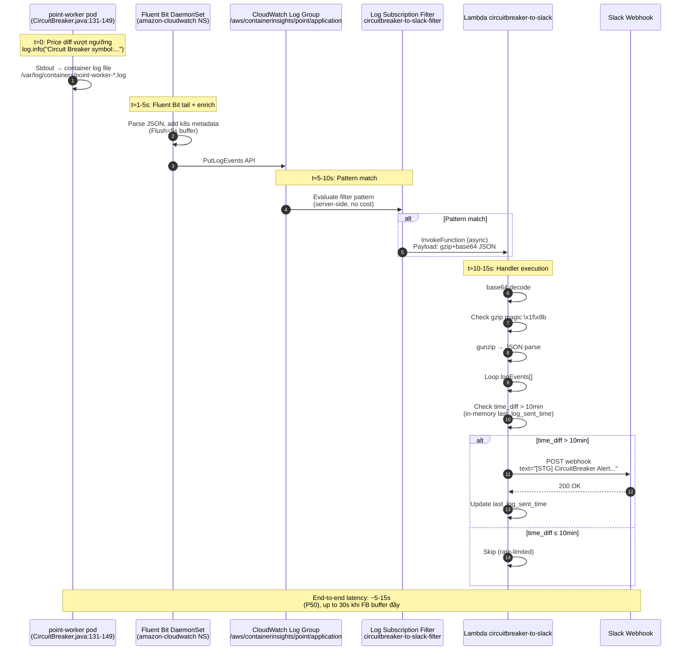

# CircuitBreaker Alert Pipeline — Research Infra (verup)

> **Phạm vi**: Nghiên cứu sâu phía INFRA của CircuitBreaker Alert pipeline trong repo `bs-exchange-infra` (verup project).
> Component: [`terraform/components/cloudwatch_circuitbreaker_lambda`](../../../../bs-exchange-infra/terraform/components/cloudwatch_circuitbreaker_lambda/)
> Lambda function: `circuitbreaker-to-slack` (Python 3.9, ap-northeast-1)
> Thời điểm khảo sát: 2026-04-21

## Mục lục

- [1. Tổng quan kiến trúc](#1-tổng-quan-kiến-trúc)
- [2. Terraform resources breakdown](#2-terraform-resources-breakdown)
  - [2.1. Bảng resources + risk matrix](#21-bảng-resources--risk-matrix)
  - [2.2. Provider + versions.tf](#22-provider--versionstf)
  - [2.3. `aws_lambda_function.circuitbreaker_to_slack`](#23-aws_lambda_functioncircuitbreaker_to_slack)
  - [2.4. IAM role + policy](#24-iam-role--policy)
  - [2.5. `aws_cloudwatch_log_subscription_filter`](#25-aws_cloudwatch_log_subscription_filter)
  - [2.6. `aws_lambda_permission`](#26-aws_lambda_permission)
  - [2.7. `aws_lambda_layer_version` (Python layer)](#27-aws_lambda_layer_version-python-layer)
  - [2.8. Log group nguồn](#28-log-group-nguồn)
  - [2.9. Artifact lambda_function.zip được commit vào Git](#29-artifact-lambda_functionzip-được-commit-vào-git)
- [3. Lambda handler chi tiết](#3-lambda-handler-chi-tiết)
  - [3.1. Cấu trúc & initialize block](#31-cấu-trúc--initialize-block)
  - [3.2. Giải mã payload CloudWatch Logs](#32-giải-mã-payload-cloudwatch-logs)
  - [3.3. Guard gzip magic bytes](#33-guard-gzip-magic-bytes)
  - [3.4. Parse log event → trích field](#34-parse-log-event--trích-field)
  - [3.5. Rate-limit bằng global var](#35-rate-limit-bằng-global-var)
  - [3.6. Slack payload format](#36-slack-payload-format)
  - [3.7. Exception paths](#37-exception-paths)
- [4. Flow end-to-end timeline](#4-flow-end-to-end-timeline)
- [5. Filter pattern deep dive](#5-filter-pattern-deep-dive)
- [6. DEV vs STG vs PRD](#6-dev-vs-stg-vs-prd)
- [7. IAM & Networking](#7-iam--networking)
- [8. Issues & Severity matrix](#8-issues--severity-matrix)
- [9. Câu hỏi mở](#9-câu-hỏi-mở)

---

## 1. Tổng quan kiến trúc

Pipeline gồm **4 mắt xích** chạy theo chuỗi, mỗi mắt xích do 1 component/ hệ thống khác sở hữu:

| Mắt xích | Owner | Output |
|---|---|---|
| Worker Java log `Circuit Breaker symbol:*` | `bs-integration-server/point-worker` (EKS deployment `point-worker-deployment`) | `stdout` → container log file `/var/log/containers/*.log` |
| Ship log về CloudWatch | Fluent Bit DaemonSet (namespace `amazon-cloudwatch`) | Log Group `/aws/containerinsights/point/application` |
| Subscription filter match pattern + invoke Lambda | `cloudwatch_circuitbreaker_lambda` component (focus của document này) | Lambda event payload (gzip+base64) |
| Lambda parse → POST Slack Webhook | Lambda `circuitbreaker-to-slack` | Slack channel alert |

**Điểm đặc biệt** so với `cloudwatch_errorlog_lambda` (sibling component xử lý ERROR log):

- Source log là **INFO level** (không phải ERROR) — vì business logic phát log `Circuit Breaker symbol:*` ở `log.info(...)` trong `CircuitBreaker.java:131-149`.
- Có **rate-limit 10 phút** bằng global Python var `last_log_sent_time` — `cloudwatch_errorlog_lambda` không rate-limit.
- Username Slack: `PointOPECircuitBreaker` (vs `PointOPEAlert`).
- Field Slack: `*circuitbreaker_log*:` (vs `*error_log*:`).

---

## 2. Terraform resources breakdown

### 2.1. Bảng resources + risk matrix

| Resource | Tên | Risk | Ghi chú |
|---|---|:---:|---|
| `aws_lambda_function` | `circuitbreaker_to_slack` | MED | Hardcoded runtime `python3.9` (EOL), no `timeout`, no `memory_size`, no `reserved_concurrent_executions`, không dry-run source từ `${path.module}/src/` |
| `aws_iam_role` | `lambda_role` | LOW | Assume role policy chặt (chỉ `lambda.amazonaws.com`); tên role `lambda-slack-circuitbreaker-role` dễ đụng duplicate khi multi-region/multi-account deploy |
| `aws_iam_policy` | `circuitbreaker_policy` | **HIGH** | `Resource = "*"` cho `logs:CreateLogGroup/CreateLogStream/PutLogEvents/DescribeLogStreams` — IAM anti-pattern |
| `aws_iam_role_policy_attachment` | `circuitbreaker_policy_attachment` | LOW | Bình thường |
| `aws_cloudwatch_log_subscription_filter` | `log_filter` | MED | Không có `distribution`, phụ thuộc log group của `cloudwatch_loggroup` component (no explicit `depends_on`, không dùng `data` lookup) |
| `aws_lambda_permission` | `log_permission` | **HIGH** | `source_arn = "arn:aws:logs:ap-northeast-1:${var.account_id}:log-group:*:*"` — wildcard log-group; bất kỳ log group nào trong account đều có thể invoke Lambda |
| `aws_lambda_layer_version` | `python_module` | MED | File ZIP `1.6MB` commit vào Git, build từ 2023-06-04 (per zip mtime), chứa `requests` + deps `idna-3.4`, `certifi`, `charset_normalizer`, `urllib3` — dependency drift + đóng kín trong Git, không có quy trình rebuild |
| Provider `aws` | — | MED | Pin `~> 4.0` — lỗi thời so với convention BB-1917 (`~> 5.0`) |

### 2.2. Provider + versions.tf

`versions.tf` (`cloudwatch_circuitbreaker_lambda/versions.tf:1-9`):

```hcl
terraform {
  required_providers {
    aws = {
      source  = "hashicorp/aws"
      version = "~> 4.0"
    }
  }
}
```

- Pin `~> 4.0` — **không tuân BB-1917 convention** trong `bs-exchange-infra/CLAUDE.md` (`aws ~> 5.0` là default).
- Không có `required_version` cho Terraform CLI.
- Provider `aws` được khai báo **cả ở `main.tf:2-4`** (region) **lẫn `versions.tf`** — phân tán, không khớp convention BB-1917 là "shared locals trong `main.tf`".

### 2.3. `aws_lambda_function.circuitbreaker_to_slack`

Trích (`main.tf:7-29`):

```hcl
resource "aws_lambda_function" "circuitbreaker_to_slack" {
  filename      = "lambda_function.zip"
  function_name = "circuitbreaker-to-slack"
  role          = aws_iam_role.lambda_role.arn
  handler       = "lambda_function.lambda_handler"
  runtime       = "python3.9"

  environment {
    variables = {
      SLACK_WEBHOOK_URL  = var.slack_webhook_url
      SLACK_ALERT_EMOJI  = var.slack_alert_emoji
      SLACK_WARNING_TEXT = var.slack_warning_text
    }
  }

  source_code_hash = filebase64sha256("lambda_function.zip")

  layers = [
    aws_lambda_layer_version.python_module.arn
  ]
}
```

**Thiếu sót quan trọng**:

1. **Không có `timeout`** (default 3s) — có thể đủ cho 1 lần POST Slack, nhưng nếu Slack lag hoặc payload nhiều log event → dễ time-out.
2. **Không có `memory_size`** (default 128 MB).
3. **Không có `reserved_concurrent_executions`** — Lambda có thể scale parallel → thủng rate-limit in-memory (xem [3.5](#35-rate-limit-bằng-global-var)).
4. **Không có `tracing_config`** (X-Ray).
5. **Không có `logging_config`** để chỉ định log group tự sở hữu (mặc định sẽ tạo `/aws/lambda/circuitbreaker-to-slack` — mà IAM policy ở đây dùng `Resource = "*"` nên vẫn ghi được).
6. **Không có `architectures`** — mặc định là `x86_64`, không phải `arm64` (Graviton giảm 20% cost).
7. **Không có `dead_letter_config`** — nếu Lambda fail, không có DLQ catch lại.
8. **Không có `environment.variables` cho các tham số rate-limit** (10 phút hardcode trong handler).
9. **`SLACK_WEBHOOK_URL` pass plaintext** qua `environment.variables` — nên dùng Secrets Manager hoặc SSM Parameter Store (`kms_key_arn`).
10. **`filename = "lambda_function.zip"`** — path **tương đối** tới working dir Terraform. Khi chạy qua `terraform.sh` wrapper, working dir sẽ là component root (OK), nhưng pattern BB-1917 khuyến nghị `data.archive_file` build từ `${path.module}/lambda/...`.

### 2.4. IAM role + policy

`main.tf:32-73`:

```hcl
resource "aws_iam_role" "lambda_role" {
  name = "lambda-slack-circuitbreaker-role"
  assume_role_policy = jsonencode({
    Version = "2012-10-17"
    Statement = [{
      Effect    = "Allow"
      Principal = { Service = "lambda.amazonaws.com" }
      Action    = "sts:AssumeRole"
    }]
  })
}

resource "aws_iam_policy" "circuitbreaker_policy" {
  name = "lambda-slack-circuitbreaker-policy"
  policy = jsonencode({
    Version = "2012-10-17"
    Statement = [{
      Effect = "Allow"
      Action = [
        "logs:CreateLogGroup",
        "logs:CreateLogStream",
        "logs:PutLogEvents",
        "logs:DescribeLogStreams"
      ]
      Resource = "*"   # ← HIGH RISK
    }]
  })
}
```

Vấn đề:

- `Resource = "*"` là **HIGH-severity IAM finding** khi chạy qua tooling security review (tfsec rule `AWS099`, checkov `CKV_AWS_111`). Nên thu hẹp về log group thực:
  ```
  arn:aws:logs:ap-northeast-1:<account>:log-group:/aws/lambda/circuitbreaker-to-slack:*
  ```
- Không attach `AWSLambdaBasicExecutionRole` managed policy (thường dùng thay vì tự viết) — cả 2 cách đều chạy được, nhưng managed policy rõ intent hơn.
- **Role name hardcoded** `lambda-slack-circuitbreaker-role` — không có `env` suffix, nên **không thể deploy cùng account 2 lần** (ví dụ deploy PRD-EX vào cùng account DEV sẽ đụng name). Hiện DEV-EX + STG-EX ở 2 account khác nhau nên chưa lộ; khi mở rộng (review/preprod) sẽ vỡ.

### 2.5. `aws_cloudwatch_log_subscription_filter`

`main.tf:76-81`:

```hcl
resource "aws_cloudwatch_log_subscription_filter" "log_filter" {
  name            = "circuitbreaker-to-slack-filter"
  log_group_name  = var.log_group
  filter_pattern  = var.filter_pattern
  destination_arn = aws_lambda_function.circuitbreaker_to_slack.arn
}
```

- **Không có `role_arn`** — correct (với destination là Lambda, AWS dùng `aws_lambda_permission` thay vì role; chỉ khi destination là Firehose / Kinesis mới cần).
- **Không có `distribution`** (chỉ liên quan khi destination là Kinesis stream).
- **Phụ thuộc ngầm** vào log group được tạo ở `cloudwatch_loggroup/containerinsights.tf:1-4`:
  ```hcl
  resource "aws_cloudwatch_log_group" "containerinsights_application" {
    name = "/aws/containerinsights/${var.eks_cluster_name}/application"
    ...
  }
  ```
  — Hai component **hoàn toàn tách state**, không có dependency rõ. Nếu apply `cloudwatch_circuitbreaker_lambda` trước `cloudwatch_loggroup`, Terraform sẽ lỗi `ResourceNotFoundException`. (Thực tế pipeline hoạt động vì log group đã được tạo từ lâu + auto-create-group của Fluent Bit.)

### 2.6. `aws_lambda_permission`

`main.tf:84-89`:

```hcl
resource "aws_lambda_permission" "log_permission" {
  action        = "lambda:InvokeFunction"
  function_name = aws_lambda_function.circuitbreaker_to_slack.function_name
  principal     = "logs.ap-northeast-1.amazonaws.com"
  source_arn    = "arn:aws:logs:ap-northeast-1:${var.account_id}:log-group:*:*"
}
```

**Vấn đề HIGH**:

- `source_arn` dùng `log-group:*:*` wildcard → **bất kỳ log group nào** trong account + region đều có thể invoke Lambda này (nếu kẻ tấn công có quyền `PutSubscriptionFilter`).
- Pattern AWS docs khuyến nghị: `arn:aws:logs:<region>:<account>:log-group:<log-group-name>:*` (`:*` cuối chỉ log-stream, không phải log-group).
- Nên thu hẹp thành:
  ```
  arn:aws:logs:ap-northeast-1:${var.account_id}:log-group:/aws/containerinsights/point/application:*
  ```
- Region `ap-northeast-1` hardcoded trong chuỗi ARN → không portable sang region khác.

### 2.7. `aws_lambda_layer_version` (Python layer)

`main.tf:92-101`:

```hcl
resource "aws_lambda_layer_version" "python_module" {
  filename            = "python_module.zip"
  layer_name          = "python-module"
  compatible_runtimes = ["python3.9"]
  source_code_hash    = filebase64sha256("python_module.zip")
}
```

Layer chứa (từ `unzip -l python_module.zip`):

| Package | Version | Date ZIP |
|---|---|---|
| `idna` | 3.4 | 2023-06-04 |
| `certifi` | (latest 2023) | 2023-06-04 |
| `charset_normalizer` | 3.1.0 | 2023-06-04 |
| `urllib3` | (latest 2023) | 2023-06-04 |
| `requests` | (latest 2023) | 2023-06-04 |

Vấn đề:

- **Dependency drift** — ZIP được build **2023-06-04**, không có `requirements.txt` / `pip-tools` pin → khi rebuild sẽ bị phiên bản mới khác.
- **Không tuân convention BB-1917** — per `bs-exchange-infra/CLAUDE.md`:
  > `data.archive_file` zip `${path.module}/lambda/` với excludes `["build","*.zip","__pycache__","README.md","requirements.txt"]`; vendor deps (`pip install -t .`) trước apply; `.gitignore` loại `pymysql/`, `*.dist-info/`, `__pycache__/`
- **`compatible_runtimes` chỉ `python3.9`** — khi upgrade Python runtime (3.9 EOL 2025-10) sẽ phải rebuild cả layer.
- `layer_name = "python-module"` quá chung chung — xung đột với component khác nếu cùng account (kiểm tra: `cloudwatch_errorlog_lambda/main.tf:94` cũng dùng `python-module` → **2 component đang ghi đè layer version lẫn nhau!**).

**[CRITICAL] Layer name conflict**: Cả `cloudwatch_circuitbreaker_lambda` lẫn `cloudwatch_errorlog_lambda` đều khai báo `aws_lambda_layer_version.python_module` với `layer_name = "python-module"`. Vì `aws_lambda_layer_version` tạo **version mới** mỗi lần apply nếu `source_code_hash` đổi, **2 component cùng publish vào cùng layer name** → không gây conflict về Terraform state (mỗi component có state riêng), nhưng lãng phí + gây nhầm lẫn khi debug (1 layer_name có N versions mà thuộc 2 component khác nhau).

### 2.8. Log group nguồn

- Config ở `terraform.tfvars:1` (common cho mọi env):
  ```
  log_group = "/aws/containerinsights/point/application"
  ```
- Resource tạo log group: `cloudwatch_loggroup/containerinsights.tf:1-4` (component `cloudwatch_loggroup`).
- Fluent Bit DaemonSet ship log từ `/var/log/containers/*.log` → log group này (docs chi tiết: `docs/guides/fluent-bit-explained.md`).
- Retention: `cloudwatch_loggroup/terraform.tfvars:1` → `retention_in_days = 30`.

### 2.9. Artifact `lambda_function.zip` được commit vào Git

- File `lambda_function.zip` (1.2KB) commit trực tiếp, **không có pipeline rebuild**.
- Nội dung ZIP (`unzip -l`): duy nhất `lambda_function.py` dated 2025-12-10. Hash mới hơn source file `src/lambda_function.py` → cần kiểm tra xem ZIP có match `src/` không.
- **Drift risk**: Nếu dev sửa `src/lambda_function.py` mà quên zip lại → Terraform không detect (vì `source_code_hash` đọc từ ZIP, không phải src).
- Pattern BB-1917 (`bs-exchange-infra/CLAUDE.md`):
  > `data.archive_file` zip `${path.module}/lambda/` với excludes...
  → Terraform tự build zip mỗi lần apply từ source thực.

---

## 3. Lambda handler chi tiết

Source: `src/lambda_function.py` (69 dòng).

### 3.1. Cấu trúc & initialize block

```python
# src/lambda_function.py:1-15
import base64
import boto3           # imported nhưng không dùng → dead import
import json
import gzip
import os
from datetime import datetime, timedelta
import requests        # từ Lambda layer

# Set the webhook URL
webhook_url  = os.environ['SLACK_WEBHOOK_URL']
warning_text = os.environ['SLACK_WARNING_TEXT']
alert_emoji  = os.environ['SLACK_ALERT_EMOJI']

# Initialize last_log_sent_time as 10 minutes before the current time
last_log_sent_time = datetime.now() - timedelta(minutes=10)
```

- **`import boto3` nhưng không dùng** — tăng cold-start (dù boto3 có sẵn trong runtime, không tốn bandwidth).
- **`os.environ['...']` sẽ raise `KeyError` nếu biến không tồn tại** — không graceful (nhưng acceptable cho Lambda: fail fast).
- **`last_log_sent_time` khởi tạo ở module-level** → chỉ chạy **1 lần per cold start**. Giá trị là `now - 10min` để log event đầu tiên chắc chắn thỏa điều kiện gửi.
- **`datetime.now()` lấy giờ local** của container Lambda. Lambda AWS chạy UTC, nên tương đương `utcnow()`. Nhưng log timestamp từ CloudWatch có `Z` suffix (UTC) → so sánh chính xác khi cả hai đều là UTC. Nếu Lambda runtime đổi timezone (khó xảy ra) → race bug.

### 3.2. Giải mã payload CloudWatch Logs

```python
# src/lambda_function.py:17-33
def lambda_handler(event, context):
    global last_log_sent_time
    log_data = event['awslogs']['data']
    decoded_data = base64.b64decode(log_data)

    # Guard: ensure we actually have gzip-compressed data
    if not decoded_data.startswith(b'\x1f\x8b'):
        print(f"Not gzip payload; len={len(decoded_data)} bytes")
        return

    try:
        json_data = gzip.decompress(decoded_data)
    except Exception as e:
        print(f"Gzip decompress failed: {e}")
        return

    payload = json.loads(json_data)
```

**Format event từ CloudWatch Logs Subscription Filter** (AWS docs):

```json
{
  "awslogs": {
    "data": "<base64-encoded-gzip-json>"
  }
}
```

Sau khi decode base64 + gunzip + parse JSON:

```json
{
  "messageType": "DATA_MESSAGE",
  "owner": "123456789012",
  "logGroup": "/aws/containerinsights/point/application",
  "logStream": "ip-172-19-...",
  "subscriptionFilters": ["circuitbreaker-to-slack-filter"],
  "logEvents": [
    { "id": "...", "timestamp": 1705...., "message": "<raw log line>" }
  ]
}
```

- `messageType` có thể là `DATA_MESSAGE` (real log) hoặc `CONTROL_MESSAGE` (health-check từ CloudWatch Logs service, ~1 lần mỗi vài tháng). Handler **không check `messageType`** → nếu `CONTROL_MESSAGE` đến, `log_events = []` (hoặc key thiếu) → có thể crash ở `json.loads(log_event['message'])`.

### 3.3. Guard gzip magic bytes

```python
if not decoded_data.startswith(b'\x1f\x8b'):
    print(f"Not gzip payload; len={len(decoded_data)} bytes")
    return
```

- `\x1f\x8b` là **magic bytes của gzip** (RFC 1952).
- Tại sao cần? Khi dev **test trực tiếp Lambda từ Console** với sample event (ví dụ `{"awslogs":{"data":"..."}}` nhưng data không phải gzip), `gzip.decompress()` sẽ raise `BadGzipFile`. Guard này cho phép handler return gracefully thay vì crash.
- Ngoài ra, khi CloudWatch gửi **subscription filter test event** lúc tạo filter mới, payload đôi khi là raw JSON chứ không gzip (tuỳ version AWS).
- **Không hoàn chỉnh**: Guard này không catch trường hợp `decoded_data` ngắn hơn 2 byte → `startswith` returns False (OK) — may mắn không crash.

### 3.4. Parse log event → trích field

```python
# src/lambda_function.py:35-42
log_events = payload['logEvents']
for log_event in log_events:
    message_json_data = json.loads(log_event['message'])
    time_stamp = message_json_data['log_processed']['@timestamp']
    error_log = message_json_data['log_processed']['message']
    error_log_first_line = error_log.split('\n')[0]
    pod_name = message_json_data['kubernetes']['pod_name']
    namespace_name = message_json_data['kubernetes']['namespace_name']
```

- `log_event['message']` là **string**, phải `json.loads` vì Fluent Bit đã format thành JSON (per `fluent-bit-explained.md`: "JSON merge — Parse JSON trong log message, merge vào field `log_processed`").
- Nếu log line không phải JSON (hiếm, nhưng có thể xảy ra nếu Fluent Bit config sai hoặc container log thô) → `json.loads` raise `JSONDecodeError` → **handler crash**, CloudWatch Logs sẽ retry 2 lần theo policy → có thể duplicate Slack nếu retry thành công nửa chừng.
- Không có `try/except` quanh vòng lặp — **1 log event hỏng làm fail cả batch**.
- **Assumption silent**: `message_json_data` luôn có `log_processed.@timestamp`, `log_processed.message`, `kubernetes.pod_name`, `kubernetes.namespace_name`. Nếu Fluent Bit config thay đổi (ví dụ đổi sang CloudWatch Agent) → KeyError.

### 3.5. Rate-limit bằng global var

```python
# src/lambda_function.py:44-66
time_diff = datetime.strptime(time_stamp, "%Y-%m-%dT%H:%M:%S.%fZ") - last_log_sent_time

if time_diff > timedelta(minutes=10):
    alert_text = alert_emoji + warning_text + alert_emoji + "\n"
    alert_text += "<!channel>" + "\n"
    alert_text += "*namespace_name*: " + namespace_name + "\n"
    alert_text += "*datetime*: " + time_stamp + "\n"
    alert_text += "*pod_name*: " + pod_name + "\n"
    alert_text += "*circuitbreaker_log*: " + error_log_first_line + "\n"

    response = requests.post(webhook_url, data=json.dumps({
        "text":       alert_text,
        "icon_emoji": alert_emoji,
        "username":   "PointOPECircuitBreaker"
    }))

    if response.status_code == 200:
        print('Successfully posted JSON data to Slack')
        last_log_sent_time = datetime.strptime(time_stamp, "%Y-%m-%dT%H:%M:%S.%fZ")
    else:
        print('Failed to post JSON data to Slack')
```

**Điểm yếu của rate-limit in-memory**:

1. **Cold start reset**: Lambda container restart → `last_log_sent_time = now - 10min` lại → alert tiếp theo luôn thỏa điều kiện. Không phải bug nghiêm trọng (vì CircuitBreaker event hiếm), nhưng không reliable để rate-limit production.
2. **Multiple concurrent containers**: AWS Lambda scale theo concurrent invocations. Nếu 2 log batch đến gần nhau → AWS có thể chạy 2 container song song → **mỗi container có `last_log_sent_time` riêng** → gửi Slack **cả hai lần**. Không có `reserved_concurrent_executions = 1` để chống.
3. **Warm container race condition**: Trong 1 container warm, `global` var được ghi sau khi POST Slack thành công. Nếu `response.status_code != 200`, `last_log_sent_time` **không update** → lần sau vẫn gửi. Có thể là intentional (retry) nhưng cũng có thể spam Slack nếu Slack 5xx liên tục.
4. **Timestamp comparison dùng log event timestamp, không phải wall-clock**: Nếu Fluent Bit delay → log event timestamp lỗi thời → `time_diff < 10min` (so với `last_log_sent_time` được set bằng timestamp cũ hơn nữa) → may mắn vẫn gửi. Nhưng nếu log event timestamp **lùi hơn** `last_log_sent_time` (out-of-order delivery) → `time_diff` âm → `< 10min` → **skip!** 
5. **Rate-limit trên symbol bất kỳ**: 1 lần CircuitBreaker cho BTC-JPY sẽ chặn alert của ETH-JPY trong 10 phút. Nên rate-limit theo `(symbolId, minute-bucket)` mới chính xác nghiệp vụ.

**Design đúng** cho rate-limit production:
- Dùng **DynamoDB conditional put** với TTL 10 phút + key = `pod_name+hash(error)`.
- Hoặc **ElastiCache Redis SETNX** với TTL.
- Hoặc **Slack rate-limit** ở source (Worker Java chỉ phát log 1 lần).

### 3.6. Slack payload format

- Chỉ dùng field `text` + `icon_emoji` + `username` — **không dùng Block Kit** (https://api.slack.com/block-kit).
- Block Kit cho phép formatting giàu hơn: buttons, sections, dividers, links → production-grade alert thường dùng Block Kit.
- `<!channel>` là Slack mention syntax → tag cả channel (ping mọi thành viên online). Đối với alert noise-prone, nên dùng `<!here>` hoặc chỉ tag 1 user group.

### 3.7. Exception paths

| Path | Current behavior | Rủi ro |
|---|---|---|
| `event['awslogs']` thiếu | `KeyError` → Lambda fail → CloudWatch retry 2 lần | Duplicate Slack nếu retry thành công sau đó |
| `decoded_data` không gzip | `return` (guard catch) | Miss event — OK |
| Gzip decompress fail | `return` (try/except catch) | Miss event — OK |
| `json.loads(json_data)` fail | Uncaught → Lambda fail → retry | Duplicate Slack |
| `log_event['message']` không JSON | Uncaught `json.loads` | Fail cả batch |
| `message_json_data['log_processed']` thiếu | `KeyError` → fail cả batch | Không rõ root cause trong CloudWatch |
| `datetime.strptime` fail (timestamp format đổi) | `ValueError` → fail cả batch | Alert pipeline "chết silent" |
| `requests.post` raise (timeout, DNS, SSL) | Uncaught → fail cả batch | Slack alert mất |
| Slack 429 rate-limit | `response.status_code != 200` → "Failed to post" print; không update `last_log_sent_time` | Lần sau gửi lại; có thể loop 429 |
| Slack 5xx | Giống 429 | Giống trên |

---

## 4. Flow end-to-end timeline



**Latency chi tiết** (ước lượng):

| Mắt xích | Latency typical | Max |
|---|---|---|
| Worker Java log → stdout | <1ms | — |
| Container log file → Fluent Bit tail | ~100ms (read mode: tail) | — |
| Fluent Bit Flush interval | 5s (cấu hình) | 5s |
| Fluent Bit → CloudWatch API | ~200ms | 1-2s khi retry |
| CloudWatch → Subscription Filter eval | <100ms | — |
| Subscription Filter → Lambda invoke | ~500ms async | 1-2s khi throttle |
| Lambda cold start | 300-800ms | 1-2s (vendor Python layer) |
| Lambda warm + Slack POST | ~200ms | 3s (default timeout) |
| **Total P50** | **~5-7s** | — |
| **Total P95** | — | **~15-30s** |

---

## 5. Filter pattern deep dive

Trong cả DEV và STG (giống nhau, `tfvars/dev-ex.tfvars:10` + `tfvars/stg-ex.tfvars:10`):

```
{ $.kubernetes.pod_name = "point-worker-*" && $.log_processed.level = "INFO" && $.log_processed.message = "Circuit Breaker symbol:*" }
```

### 5.1. Syntax CloudWatch Logs Filter Pattern (JSON mode)

- `{ }` bao ngoài → báo cho CloudWatch parse JSON.
- `$.field.path` → JSONPath selector (chỉ hỗ trợ 1-level wildcard, không recursive).
- `=` → match (với quotes → literal; wildcard `*` cho prefix/suffix/contains match).
- `!=` → not match.
- `&&` / `||` → AND / OR.
- Giá trị chuỗi **phải quote** (double-quote) khi có ký tự đặc biệt.

### 5.2. Tại sao phải escape trong tfvars

tfvars là HCL, string dùng `"..."` → phải escape quote trong giá trị bằng `\"`:

```
filter_pattern = "{ $.kubernetes.pod_name = \"point-worker-*\" && $.log_processed.level = \"INFO\" && $.log_processed.message = \"Circuit Breaker symbol:*\" }"
```

Terraform sẽ đưa string này vào `filter_pattern` của `aws_cloudwatch_log_subscription_filter` như-là (không unescape thêm).

### 5.3. 3 điều kiện AND

1. **`$.kubernetes.pod_name = "point-worker-*"`** — chỉ match log của point-worker pods (không phải api/admin/app/mmh).
2. **`$.log_processed.level = "INFO"`** — vì business code phát log qua `log.info(...)` chứ không phải `log.error(...)`.
3. **`$.log_processed.message = "Circuit Breaker symbol:*"`** — prefix match với chuỗi `"Circuit Breaker symbol:"` từ `CircuitBreaker.java:133`.

### 5.4. Server-side filtering — cost saving

CloudWatch Logs **áp filter trước khi invoke Lambda** → Lambda **chỉ bị trigger khi có match** → tiết kiệm:
- Lambda invocation cost ($0.20 / 1M invocations).
- Lambda duration cost (ms-GB).
- Nếu không có filter → mọi log line của point-worker sẽ vào Lambda → với traffic production có thể là **hàng triệu invocation/ngày** → cost đáng kể.

---

## 6. DEV vs STG vs PRD

### 6.1. Bảng so sánh

| Config | DEV (`dev-ex.tfvars`) | STG (`stg-ex.tfvars`) | PRD |
|---|---|---|---|
| `account_id` | `845131030484` | `520411743393` | **Không có** |
| `slack_webhook_url` | `.../TFBAJNY6P/B057F5PCCBV/AXSqj...` | `.../TFBAJNY6P/B0A2302S6L9/Anmgy...` | — |
| `slack_alert_emoji` | `:fire:` | `:fire:` | — |
| `slack_warning_text` | `[DEV] CircuitBreaker Alert` | `[STG] CircuitBreaker Alert` | — |
| `filter_pattern` | Như [5.1] | Như [5.1] | — |
| `log_group` (common) | `/aws/containerinsights/point/application` | Giống DEV | — |

### 6.2. Không có `prd-ex.tfvars` — vì sao?

Per `verup/CLAUDE.md`:
> **Verup (BB) has not yet deployed a PRD environment.** All changes are currently applied only to `DEV` and `STG`.

Kiểm tra `find ... -name "prd-ex.tfvars"` → **0 file** trong toàn bộ `terraform/components/`.

### 6.3. Cần gì để rollout PRD sau này

1. **Tạo `tfvars/prd-ex.tfvars`** với:
   - `account_id` = PRD AWS account.
   - `slack_webhook_url` = Slack webhook channel **PRD** (khác STG).
   - `slack_warning_text = "[PRD] CircuitBreaker Alert"`.
   - `slack_alert_emoji` = có thể đổi thành `:rotating_light:` để phân biệt severity.
2. **Tạo log group nguồn ở PRD** — thông qua `cloudwatch_loggroup` component khi deploy PRD.
3. **Rebuild layer** — `requests` 2023 có thể có CVE → cần update.
4. **Migrate webhook URL sang Secrets Manager** trước khi chạy PRD (xem [Issues](#8-issues--severity-matrix)).
5. **Add PRD-specific rate-limit** (Redis-backed) vì traffic PRD cao hơn → in-memory rate-limit sẽ rò nhiều lỗi hơn.
6. **Tạo CloudWatch Alarm** cho chính Lambda này (errors, throttles, duration) → alert vào Slack khi Lambda fail.

### 6.4. Webhook có khác nhau không?

- DEV và STG dùng **webhook URL khác nhau** → point vào 2 Slack channel khác nhau.
- STG sử dụng **cùng webhook URL** với `cloudwatch_errorlog_lambda/tfvars/stg-ex.tfvars:5` (so sánh bằng grep) → nghĩa là CircuitBreaker + ApplicationError cùng gửi vào 1 channel STG, phân biệt bằng `warning_text` + `username`.
- DEV của `cloudwatch_errorlog_lambda` dùng webhook **khác** với CircuitBreaker (`T048PSVF2Q2/B0526EFJH47/...` vs `TFBAJNY6P/B057F5PCCBV/...`) → workspace Slack **khác nhau**!

---

## 7. IAM & Networking

### 7.1. Lambda có trong VPC không?

- **Không** — `main.tf:7-29` **không có `vpc_config` block** → Lambda chạy trong **AWS Lambda service VPC** (không phải VPC của khách hàng).
- So với `sns-alert/lambda/main.tf:5-8` và `waf-maintenance-lambda/lambda.tf:5-8` đều có `vpc_config`.

### 7.2. Cần VPC để gọi Slack không?

- **Không bắt buộc**. Slack webhook là public HTTPS endpoint (`hooks.slack.com`) → Lambda ngoài VPC gọi internet qua **default NAT của AWS Lambda service** (không qua VPC NAT của khách).
- **Nhưng**: Nếu sau BB-1554 (S3 SSE-KMS) hoặc BB-1556 (security hardening) yêu cầu **mọi egress phải qua NAT + VPC Flow Logs**, thì Lambda không-VPC sẽ là **ngoại lệ** không tuân policy.
- Nếu bật VPC cho Lambda → cần:
  - Subnet IDs (private subnets).
  - Security group cho phép egress 443.
  - **NAT Gateway** (hoặc VPC endpoint cho `execute-api` nhưng Slack không có VPC endpoint) → vẫn cần internet.

### 7.3. IAM cho CloudWatch Logs only, không Secrets/SSM

- IAM policy (`main.tf:52-67`) chỉ permit `logs:*` → Lambda **không thể** đọc Secrets Manager hay SSM.
- Nếu muốn di chuyển `SLACK_WEBHOOK_URL` → Secrets Manager, cần:
  - Thêm `secretsmanager:GetSecretValue` với `Resource = "arn:aws:secretsmanager:<region>:<account>:secret:slack-webhook-circuitbreaker-*"`.
  - Hoặc SSM Parameter Store: `ssm:GetParameter`.
  - Kèm KMS decrypt nếu secret encrypted với CMK.

### 7.4. Webhook URL plaintext — rủi ro

- `dev-ex.tfvars:5` + `stg-ex.tfvars:5` chứa webhook URL **plaintext** trong Git.
- Ai có read access repo → có webhook URL → có thể spam Slack channel (không leak data, chỉ gây phiền).
- **Tối thiểu**: Move webhook URL sang Secrets Manager, Terraform `data "aws_secretsmanager_secret_version"` để lookup tại apply time.
- **Đã leak**: Các URL hiện tại đã trong Git history → nên **revoke + reissue** webhook từ Slack admin.

### 7.5. `aws_lambda_permission.source_arn` wildcard

Đã phân tích ở [2.6](#26-aws_lambda_permission). Tóm tắt:
- `log-group:*:*` → **bất kỳ log group nào** trong account có thể tạo subscription filter → invoke Lambda.
- Attacker với `logs:PutSubscriptionFilter` có thể spam Lambda (miễn không bị IAM deny khác).
- Fix: thu hẹp source_arn về đúng log group `/aws/containerinsights/point/application`.

---

## 8. Issues & Severity matrix

| # | Issue | Severity | Category | Fix cost | Refs |
|:--:|---|:---:|:---:|:---:|---|
| 1 | IAM policy `Resource = "*"` | HIGH | Security | Low | main.tf:63 |
| 2 | `aws_lambda_permission.source_arn` wildcard log-group | HIGH | Security | Low | main.tf:88 |
| 3 | Webhook URL plaintext trong Git tfvars | HIGH | Security | Med (Secrets Manager migration) | tfvars/*.tfvars:5 |
| 4 | Python 3.9 EOL 2025-10 | HIGH | Maintenance | Med (rebuild layer + test) | main.tf:12,96 |
| 5 | `layer_name = "python-module"` đụng với `cloudwatch_errorlog_lambda` | MED | Convention | Low (rename) | main.tf:94 |
| 6 | `lambda_function.zip` commit vào Git thay vì `data.archive_file` build | MED | Convention (BB-1917) | Med | main.tf:8 |
| 7 | Provider pin `~> 4.0` thay vì `~> 5.0` (convention BB-1917) | MED | Convention | Low (test compat) | versions.tf:5 |
| 8 | Region `ap-northeast-1` hardcoded nhiều chỗ | MED | Portability | Low (var.region) | main.tf:3,87,88 |
| 9 | Rate-limit in-memory → race + cold-start reset | MED | Correctness | High (Redis/DynamoDB) | src/lambda_function.py:15,45,66 |
| 10 | Không có `timeout`, `memory_size`, `reserved_concurrent_executions` | MED | Operability | Low | main.tf:7-29 |
| 11 | Không có `dead_letter_config` → silent failures | MED | Operability | Low | main.tf:7-29 |
| 12 | Role name hardcode không có `env` suffix | MED | Scalability | Low (string interpolation) | main.tf:33 |
| 13 | `log_filter` không có `depends_on` log_group resource | LOW | Apply order | Low | main.tf:76-81 |
| 14 | Handler crash trên log event malformed (no try/except around loop) | MED | Correctness | Low | src/lambda_function.py:36-42 |
| 15 | Không check `messageType == "DATA_MESSAGE"` | LOW | Correctness | Low | src/lambda_function.py:35 |
| 16 | `<!channel>` mention noisy | LOW | UX | Low (dùng `<!here>`) | src/lambda_function.py:50 |
| 17 | Slack payload dùng `text` không Block Kit | LOW | UX | Med | src/lambda_function.py:57-61 |
| 18 | `import boto3` không dùng | LOW | Code quality | Trivial | src/lambda_function.py:2 |
| 19 | Không có tests (không có `tests/` folder) | MED | Correctness | Med | — |
| 20 | Không có variable validation / precondition (convention BB-1917) | MED | Convention | Low | main.tf:104-126 |
| 21 | `provider "aws"` khai báo cả ở `main.tf` lẫn `versions.tf` | LOW | Convention | Low | main.tf:2-4, versions.tf |
| 22 | Rate-limit theo toàn global thay vì theo `(symbolId, pod_name)` | MED | Correctness | Med | src/lambda_function.py:45-48 |
| 23 | Khi Slack 5xx → không update `last_log_sent_time` → có thể loop retry spam | LOW | UX | Low (thêm backoff) | src/lambda_function.py:64-68 |
| 24 | Timestamp out-of-order có thể gây skip alert | LOW | Correctness | Low (max thay vì assignment) | src/lambda_function.py:66 |
| 25 | Không có CloudWatch Alarm cho chính Lambda này (errors, throttles) | MED | Operability | Low | — |
| 26 | `terraform.tfvars` (common) chứa `log_group` — không cho phép override per-env | LOW | Flexibility | Low | terraform.tfvars:1 |
| 27 | Dependency pin không có — layer build 2023, nhiều CVE tiềm ẩn | MED | Security | Med | python_module.zip |
| 28 | Không có `prd-ex.tfvars` — chưa sẵn sàng rollout PRD | — | Planned | — | — |

### Quick wins (effort < 1 ngày)

- [ ] Fix #1 (IAM Resource wildcard).
- [ ] Fix #2 (source_arn wildcard).
- [ ] Fix #5 (rename layer).
- [ ] Fix #8 (region var).
- [ ] Fix #10 (`timeout`, `memory_size`).
- [ ] Fix #18 (remove unused import).
- [ ] Fix #20 (variable validation blocks).

### Cần đầu tư riêng

- Fix #3 + #27 — Secrets Manager + layer rebuild (cùng 1 PR, nửa ngày).
- Fix #4 — Python 3.9 → 3.12 upgrade (1-2 ngày test).
- Fix #9 + #22 — Rate-limit Redis/DynamoDB (2-3 ngày).
- Fix #25 — Observability Alarm + SNS → Slack (nửa ngày).

---

## 9. Câu hỏi mở

1. **Rate-limit**: Intent ban đầu của global var rate-limit là gì? Bảo vệ Slack khỏi spam, hay giảm noise alert? Nếu là bảo vệ Slack → nên dùng Slack rate-limit API. Nếu giảm noise → nên rate-limit theo symbol.
2. **Log group application cho cả Error + CircuitBreaker**: Có plan tách channel Slack riêng cho CircuitBreaker alert (priority khác Error) hay merge?
3. **Multi-symbol batch**: Khi 5 symbols cùng trigger CircuitBreaker trong 1 giây (ví dụ market crash), liệu nên gửi 1 alert gộp hay 5 alert riêng? Handler hiện gửi riêng (nhưng chỉ 1 qua rate-limit).
4. **Python 3.9 EOL**: Timeline nào migrate sang 3.12? Có block nào (layer deps, test coverage)?
5. **Webhook Slack workspace**: 2 workspace khác nhau giữa DEV (`T048PSVF2Q2`) và STG (`TFBAJNY6P`) là intentional hay historical? PRD sẽ ở workspace nào?
6. **Fluent Bit BB-1733 IRSA migrate**: Ảnh hưởng log group naming không?
7. **Subscription filter limit**: Mỗi log group AWS giới hạn **2 subscription filter** (soft limit). Hiện `cloudwatch_to_s3` + `cloudwatch_errorlog_lambda` + `cloudwatch_circuitbreaker_lambda` có thể cùng attach vào `/aws/containerinsights/point/application` → có đụng limit không? Cần confirm.
8. **`aws_lambda_layer_version` collision**: Nếu 2 component cùng publish layer `python-module`, version nào được tham chiếu? Xác nhận bằng AWS Console có bao nhiêu version của `python-module` layer.
9. **Dependency rebuild process**: Ai/khi nào rebuild `python_module.zip`? Có CI check CVE `requests`/`urllib3` không?
10. **PRD Slack channel strategy**: Có dùng chung channel với STG ban đầu (cheap) hay tách riêng (noise isolation) từ đầu?

---

## Phụ lục A — File references

- `bs-exchange-infra/terraform/components/cloudwatch_circuitbreaker_lambda/main.tf` (127 dòng)
- `bs-exchange-infra/terraform/components/cloudwatch_circuitbreaker_lambda/versions.tf` (9 dòng)
- `bs-exchange-infra/terraform/components/cloudwatch_circuitbreaker_lambda/terraform.tfvars` (1 dòng common)
- `bs-exchange-infra/terraform/components/cloudwatch_circuitbreaker_lambda/tfvars/dev-ex.tfvars` (10 dòng)
- `bs-exchange-infra/terraform/components/cloudwatch_circuitbreaker_lambda/tfvars/stg-ex.tfvars` (10 dòng)
- `bs-exchange-infra/terraform/components/cloudwatch_circuitbreaker_lambda/src/lambda_function.py` (69 dòng)
- `bs-exchange-infra/terraform/components/cloudwatch_circuitbreaker_lambda/lambda_function.zip` (1.2KB, 1 file bên trong)
- `bs-exchange-infra/terraform/components/cloudwatch_circuitbreaker_lambda/python_module.zip` (1.6MB, 625 files, 2023-06-04)
- `bs-exchange-infra/terraform/components/cloudwatch_loggroup/containerinsights.tf` — log group nguồn
- `bs-exchange-infra/terraform/components/cloudwatch_errorlog_lambda/` — sibling component để so sánh
- `bs-integration-server/point-worker/src/main/java/point/worker/worker/CircuitBreaker.java:131-149` — source emit log
- `docs/guides/fluent-bit-explained.md` — shipping pipeline
- `bs-exchange-infra/CLAUDE.md` — BB-1917 Terraform convention
- `verup/CLAUDE.md` — "Verup (BB) has not yet deployed a PRD environment"

## Phụ lục B — CloudWatch Logs event spec reference

```
Event structure (từ CloudWatch Logs Subscription Filter → Lambda):
{
  "awslogs": {
    "data": "<base64(gzip(json))>"
  }
}

Sau base64 decode + gunzip + json parse:
{
  "messageType":         "DATA_MESSAGE" | "CONTROL_MESSAGE",
  "owner":               "<account-id>",
  "logGroup":            "<log-group-name>",
  "logStream":           "<log-stream-name>",
  "subscriptionFilters": ["<filter-name>"],
  "logEvents": [
    {
      "id":        "<event-id>",
      "timestamp": <ms-since-epoch>,
      "message":   "<raw-log-line>"
    }
  ]
}
```

Reference: https://docs.aws.amazon.com/AmazonCloudWatch/latest/logs/SubscriptionFilters.html

## Phụ lục C — So sánh tóm tắt với `cloudwatch_errorlog_lambda`

| Aspect | `cloudwatch_circuitbreaker_lambda` | `cloudwatch_errorlog_lambda` |
|---|---|---|
| Function name | `circuitbreaker-to-slack` | `error-log-to-slack` |
| Filter level | `INFO` | `ERROR` |
| Filter message | `"Circuit Breaker symbol:*"` | (không filter message, lọc ERROR pod pattern) |
| Filter pod | `point-worker-*` | `point-*` (exclude `point-worker-*` ở DEV) |
| Rate-limit | Có (10 min global var) | **Không** — mọi event đều gửi |
| Username Slack | `PointOPECircuitBreaker` | `PointOPEAlert` |
| Field label | `circuitbreaker_log` | `error_log` |
| Role name | `lambda-slack-circuitbreaker-role` | `lambda-slack-role` |
| Layer name | `python-module` | `python-module` (collision!) |
| IAM Resource | `"*"` | `"*"` (cả hai đều bad) |
| source_arn | `log-group:*:*` | `log-group:*:*` |

Cả 2 component **copy-paste** từ cùng 1 template → sharing tất cả issues. Refactor nên làm chung 1 lần (ví dụ tạo module `terraform-aws-cloudwatch-slack-lambda` chung).
