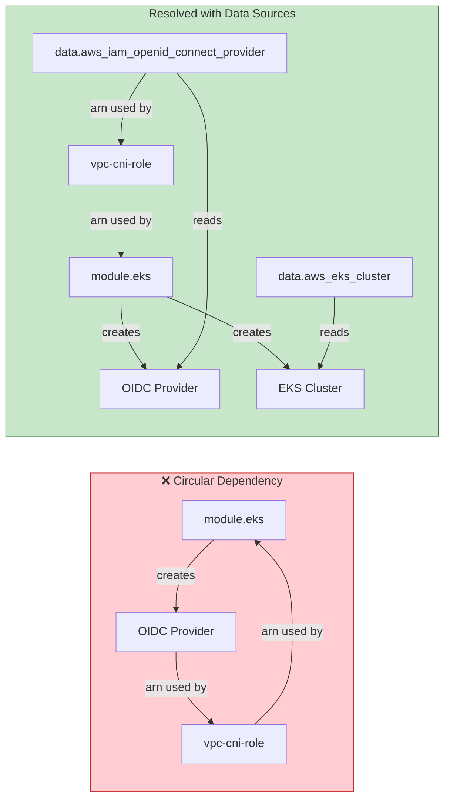
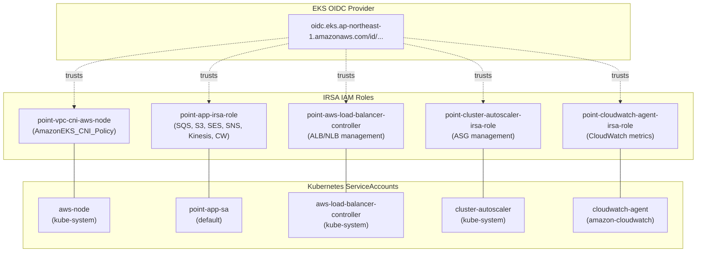
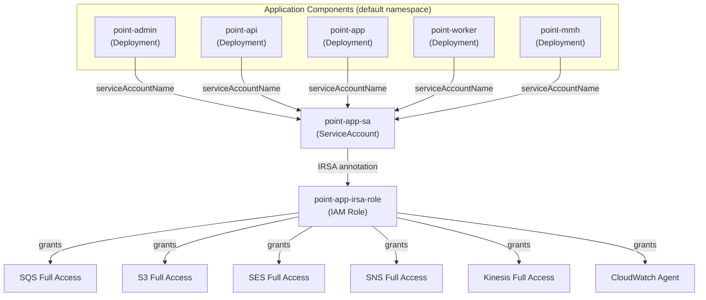
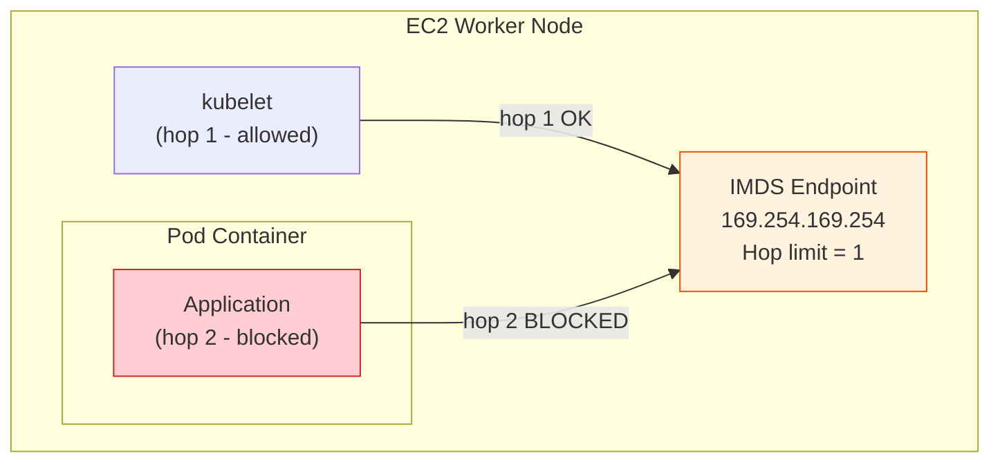
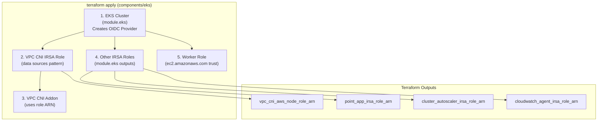
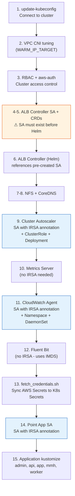
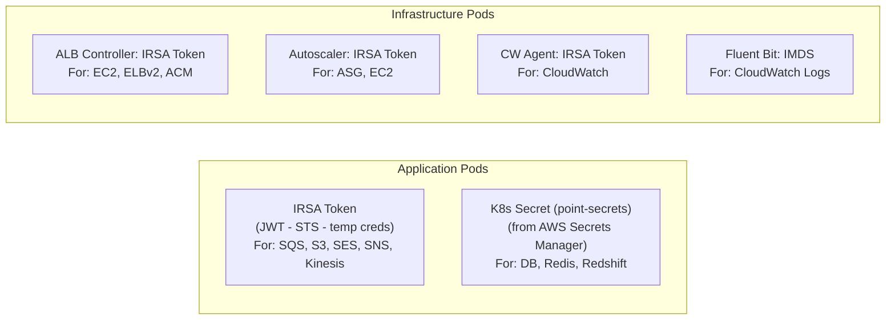

# IRSA (IAM Roles for Service Accounts) Guide - Verup Project

Updated: 2026-03-13

---

## Table of Contents

- [Part A: OIDC Provider Setup](#part-a-oidc-provider-setup)
  - [1. EKS Module Configuration](#1-eks-module-configuration)
  - [2. OIDC Trust Policy Pattern](#2-oidc-trust-policy-pattern)
- [Part B: IRSA Roles Inventory](#part-b-irsa-roles-inventory)
  - [Role 1: VPC CNI](#role-1-vpc-cni-point-vpc-cni-aws-node)
  - [Role 2: Point Application](#role-2-point-application-point-app-irsa-role)
  - [Role 3: AWS Load Balancer Controller](#role-3-aws-load-balancer-controller-point-aws-load-balancer-controller)
  - [Role 4: Cluster Autoscaler](#role-4-cluster-autoscaler-point-cluster-autoscaler-irsa-role)
  - [Role 5: CloudWatch Agent](#role-5-cloudwatch-agent-point-cloudwatch-agent-irsa-role)
- [Part C: Kubernetes ServiceAccount Manifests](#part-c-kubernetes-serviceaccount-manifests)
- [Part D: Worker Node Role vs IRSA Comparison](#part-d-worker-node-role-vs-irsa-comparison)
- [Part E: IMDSv2 & Credential Isolation](#part-e-imdsv2--credential-isolation)
- [Part F: Deployment & Provisioning Flow](#part-f-deployment--provisioning-flow)
- [Part G: Security Analysis & Recommendations](#part-g-security-analysis--recommendations)
- [Part H: Reference Files](#part-h-reference-files)

---

# Part A: OIDC Provider Setup

## 1. EKS Module Configuration

The OIDC provider is created automatically by the EKS Terraform module.

**File:** `terraform/components/eks/main.tf`

```terraform
module "eks" {
  source  = "terraform-aws-modules/eks/aws"
  version = "~> 21.1.0"

  enable_irsa        = true                    # ← Creates OIDC provider
  name               = "point"                 # Cluster name
  kubernetes_version = "1.30"
  authentication_mode = "API"                  # Modern auth (not ConfigMap)

  # Logging (audit trail for IRSA calls)
  enabled_log_types = ["api", "audit", "authenticator", "controllerManager", "scheduler"]

  # Cluster addons (VPC CNI uses IRSA via service_account_role_arn)
  addons = {
    "vpc-cni" = {
      addon_version            = "v1.21.1-eksbuild.3"
      service_account_role_arn = aws_iam_role.vpc_cni_aws_node.arn  # ← IRSA for addon
    }
    "kube-proxy" = { addon_version = "v1.30.14-eksbuild.20" }
    "coredns"    = { addon_version = "v1.11.4-eksbuild.28" }
  }
}
```

### Module Outputs Used by IRSA Roles

| Output | Usage | Consumers |
|--------|-------|-----------|
| `module.eks.oidc_provider_arn` | IAM trust policy `Principal.Federated` | All IRSA roles (except VPC CNI) |
| `module.eks.cluster_oidc_issuer_url` | Trust policy `Condition` (issuer URL) | All IRSA roles (except VPC CNI) |

## 2. OIDC Trust Policy Pattern

All IRSA roles use the same trust policy pattern with two variations:

### Standard Pattern (4 roles)

Uses `module.eks` outputs directly:

```json
{
  "Effect": "Allow",
  "Principal": {
    "Federated": "${module.eks.oidc_provider_arn}"
  },
  "Action": "sts:AssumeRoleWithWebIdentity",
  "Condition": {
    "StringEquals": {
      "${OIDC_ISSUER}:sub": "system:serviceaccount:{namespace}:{sa-name}",
      "${OIDC_ISSUER}:aud": "sts.amazonaws.com"
    }
  }
}
```

Where `${OIDC_ISSUER}` = `replace(module.eks.cluster_oidc_issuer_url, "https://", "")`

Example: `oidc.eks.ap-northeast-1.amazonaws.com/id/ABCDEF123456:sub`

### VPC CNI Pattern (1 role)

Uses `data` sources to avoid circular dependency (addon needs role ARN; role needs OIDC):

```terraform
# vpc-cni-role.tf — uses data sources instead of module.eks outputs
data "aws_eks_cluster" "vpc_cni_irsa" {
  name = var.eks.cluster_name
}

data "aws_iam_openid_connect_provider" "vpc_cni_irsa" {
  url = data.aws_eks_cluster.vpc_cni_irsa.identity[0].oidc[0].issuer
}
```

**Why the difference:** The VPC CNI addon is declared inside `module.eks` with `service_account_role_arn = aws_iam_role.vpc_cni_aws_node.arn`. If the role also referenced `module.eks.oidc_provider_arn`, Terraform would create a circular dependency. Using `data` sources breaks this cycle.



---

# Part B: IRSA Roles Inventory

The project defines **5 IRSA roles** in Terraform. Each role is bound to exactly one Kubernetes ServiceAccount.

## Overview



## Summary Table

| # | IRSA Role Name | ServiceAccount | Namespace | IAM Policies | Terraform File |
|:-:|----------------|----------------|-----------|-------------|----------------|
| 1 | `point-vpc-cni-aws-node` | `aws-node` | `kube-system` | `AmazonEKS_CNI_Policy` | `vpc-cni-role.tf` |
| 2 | `point-app-irsa-role` | `point-app-sa` | `default` | SQS, S3, SES, SNS, Kinesis, CloudWatch (6 policies) | `point-app-irsa-role.tf` |
| 3 | `point-aws-load-balancer-controller` | `aws-load-balancer-controller` | `kube-system` | ALB Controller (2 custom policies) | `aws-load-balancer-controller-role.tf` |
| 4 | `point-cluster-autoscaler-irsa-role` | `cluster-autoscaler` | `kube-system` | `AmazonEKSClusterAutoscalerPolicy` (custom) | `cluster-autoscaler-irsa-role.tf` |
| 5 | `point-cloudwatch-agent-irsa-role` | `cloudwatch-agent` | `amazon-cloudwatch` | `CloudWatchAgentServerPolicy` | `cloudwatch-agent-irsa-role.tf` |

---

## Role 1: VPC CNI (`point-vpc-cni-aws-node`)

**Purpose:** Manages pod networking — assigns ENIs and IP addresses to pods on each node.

**Type:** EKS managed addon (deployed as DaemonSet `aws-node` in `kube-system`)

| Property | Value |
|----------|-------|
| **Terraform** | `terraform/components/eks/vpc-cni-role.tf` |
| **IAM Role** | `point-vpc-cni-aws-node` |
| **ServiceAccount** | `aws-node` (kube-system) — managed by EKS addon |
| **Trust Pattern** | Data sources (circular dependency workaround) |
| **Policy** | `AmazonEKS_CNI_Policy` (AWS managed) |
| **Addon Version** | `v1.21.1-eksbuild.3` |
| **Network Policy** | Enabled (`enableNetworkPolicy = "true"`) |

**Terraform Code:**

```terraform
# Uses data sources to avoid circular dependency with module.eks
data "aws_eks_cluster" "vpc_cni_irsa" {
  name = var.eks.cluster_name
}
data "aws_iam_openid_connect_provider" "vpc_cni_irsa" {
  url = data.aws_eks_cluster.vpc_cni_irsa.identity[0].oidc[0].issuer
}

resource "aws_iam_role" "vpc_cni_aws_node" {
  name               = "${var.eks.cluster_name}-vpc-cni-aws-node"
  assume_role_policy = /* OIDC trust: system:serviceaccount:kube-system:aws-node */
}

resource "aws_iam_role_policy_attachment" "vpc_cni_aws_node" {
  role       = aws_iam_role.vpc_cni_aws_node.name
  policy_arn = "arn:aws:iam::aws:policy/AmazonEKS_CNI_Policy"
}
```

**Key Detail:** The VPC CNI policy is explicitly **not** attached to the worker node role. Comment in `worker-role-attach.tf` line 16:
```
# AmazonEKS_CNI_Policy is attached via IRSA to kube-system/aws-node (see vpc-cni-role.tf), not the worker role.
```

This means CNI permissions are granted **only** via IRSA — a clean least-privilege implementation.

**AmazonEKS_CNI_Policy Permissions:**

| Permission | Purpose |
|-----------|---------|
| `ec2:AssignPrivateIpAddresses` | Assign secondary IPs to ENIs for pod networking |
| `ec2:AttachNetworkInterface` | Attach new ENIs to nodes when IP pool exhausted |
| `ec2:CreateNetworkInterface` | Create new ENIs for pod networking |
| `ec2:DeleteNetworkInterface` | Clean up ENIs on pod termination |
| `ec2:DescribeInstances` | Discover node capacity and current ENI allocation |
| `ec2:DescribeNetworkInterfaces` | Track ENI state |
| `ec2:DetachNetworkInterface` | Detach ENIs during cleanup |
| `ec2:ModifyNetworkInterfaceAttribute` | Configure ENI settings |
| `ec2:UnassignPrivateIpAddresses` | Release IPs back to pool |
| `ec2:DescribeTags` | Read resource tags for CNI configuration |

---

## Role 2: Point Application (`point-app-irsa-role`)

**Purpose:** Provides AWS service access to all application components (admin, api, app, worker, mmh).

**Type:** Application workload — all 5 deployment types share this single ServiceAccount.

| Property | Value |
|----------|-------|
| **Terraform** | `terraform/components/eks/point-app-irsa-role.tf` |
| **IAM Role** | `point-app-irsa-role` |
| **ServiceAccount** | `point-app-sa` (default namespace) |
| **Trust Pattern** | Standard (module.eks outputs) |
| **Policies** | 6 AWS managed policies |
| **K8s Manifest (DEV)** | `k8s-manifests/point/dev-ex/point-app-service-account.yaml` |
| **K8s Manifest (STG)** | `k8s-manifests/point/stg-ex/point-app-service-account.yaml` |

**Attached IAM Policies:**

| Policy | Type | Scope | Used By |
|--------|------|-------|---------|
| `AmazonSQSFullAccess` | AWS Managed | All SQS queues | point-worker (async jobs) |
| `AmazonS3FullAccess` | AWS Managed | All S3 buckets | point-api, point-app (KYC, reports, assets) |
| `AmazonSESFullAccess` | AWS Managed | All SES operations | point-api (email sending) |
| `AmazonSNSFullAccess` | AWS Managed | All SNS topics | point-worker (alert publishing) |
| `AmazonKinesisFullAccess` | AWS Managed | All Kinesis streams | point-app (stream processing) |
| `CloudWatchAgentServerPolicy` | AWS Managed | CloudWatch | All components (metrics/logs) |

**ServiceAccount YAML (DEV):**

```yaml
apiVersion: v1
kind: ServiceAccount
metadata:
  annotations:
    eks.amazonaws.com/role-arn: arn:aws:iam::845131030484:role/point-app-irsa-role
  name: point-app-sa
  namespace: default
```

**Shared by All Application Deployments:**

The base deployment template (`k8s-manifests/point/base/deployment.yaml`) references this ServiceAccount:

```yaml
spec:
  template:
    spec:
      serviceAccountName: point-app-sa   # ← All components use this SA
      securityContext:
        runAsNonRoot: true
        seccompProfile:
          type: RuntimeDefault
```

| Component | Kustomization Overlay | Node Group |
|-----------|----------------------|------------|
| point-admin | `point/{env}/admin/` | admin nodes |
| point-api | `point/{env}/api/` | api nodes |
| point-app | `point/{env}/app/` | app nodes |
| point-worker | `point/{env}/worker/` | worker nodes |
| point-mmh | `point/{env}/mmh/` | mmh nodes |

**Architecture Decision — Single SA for All Components:**



> **Trade-off:** Using one SA for all components simplifies management but means `point-admin` gets SQS access it doesn't need, and `point-worker` gets SES access it doesn't use. See Part G for per-component IRSA recommendation.

---

## Role 3: AWS Load Balancer Controller (`point-aws-load-balancer-controller`)

**Purpose:** Provisions and manages AWS ALB/NLB resources from Kubernetes Ingress/Service objects.

**Type:** Infrastructure controller — deployed via Helm in `kube-system`.

| Property | Value |
|----------|-------|
| **Terraform (Role)** | `terraform/components/eks/aws-load-balancer-controller-role.tf` |
| **Terraform (Policy)** | `terraform/components/eks/aws-load-balancer-controller-policy.tf` |
| **IAM Role** | `point-aws-load-balancer-controller` |
| **ServiceAccount** | `aws-load-balancer-controller` (kube-system) |
| **Trust Pattern** | Standard (module.eks outputs) |
| **Helm Chart** | `aws-load-balancer-controller` v3.1.0 |
| **K8s Manifest (DEV)** | `k8s-manifests/point/dev-ex/aws-load-balancer-controller-service-account.yaml` |
| **K8s Manifest (STG)** | `k8s-manifests/point/stg-ex/aws-load-balancer-controller-service-account.yaml` |

**Policy Source (fetched at terraform apply):**

```terraform
data "http" "aws_load_balancer_controller_policy_json" {
  url = "https://raw.githubusercontent.com/kubernetes-sigs/aws-load-balancer-controller/v3.1.0/docs/install/iam_policy.json"
}

resource "aws_iam_policy" "aws_load_balancer_controller_policy" {
  name   = "AWSLoadBalancerControllerIAMPolicy"
  policy = data.http.aws_load_balancer_controller_policy_json.response_body
}
```

**Attached Policies:**

| Policy | Source | Scope |
|--------|--------|-------|
| `AWSLoadBalancerControllerIAMPolicy` | GitHub v3.1.0 | EC2, ELBv2, ACM, WAFv2, Shield, Cognito |
| `AWSLoadBalancerControllerAdditionalIAMPolicy` | GitHub v3.1.0 | Additional EC2, ELBv2 (v1→v2 migration) |

**Helm Settings (ServiceAccount pre-created):**

```yaml
# k8s-manifests/point/{env}/aws-load-balancer-controller.yaml
serviceAccount:
  create: false                              # SA already exists (with IRSA annotation)
  name: aws-load-balancer-controller
  automountServiceAccountToken: true         # Required for IRSA JWT injection
rbac:
  create: true                               # Helm creates ClusterRole + Binding
```

**Why SA is Pre-Created:** The ServiceAccount with its `eks.amazonaws.com/role-arn` annotation must exist **before** the Helm chart installs. This ensures the controller pod starts with IRSA credentials from the first moment.

---

## Role 4: Cluster Autoscaler (`point-cluster-autoscaler-irsa-role`)

**Purpose:** Scales EKS node groups up/down based on pod scheduling demands.

**Type:** Cluster infrastructure — deployed as Deployment in `kube-system`.

| Property | Value |
|----------|-------|
| **Terraform (Role)** | `terraform/components/eks/cluster-autoscaler-irsa-role.tf` |
| **Terraform (Policy)** | `terraform/components/eks/cluster-autoscaler-policy.json` |
| **IAM Role** | `point-cluster-autoscaler-irsa-role` |
| **ServiceAccount** | `cluster-autoscaler` (kube-system) |
| **Trust Pattern** | Standard (module.eks outputs) |
| **Image** | `registry.k8s.io/autoscaling/cluster-autoscaler:v1.28.7` |
| **K8s Manifest (DEV)** | `k8s-manifests/point/dev-ex/kube-system/cluster-autoscaler.yaml` |
| **K8s Manifest (STG)** | `k8s-manifests/point/stg-ex/kube-system/cluster-autoscaler.yaml` |

**Custom IAM Policy (`AmazonEKSClusterAutoscalerPolicy`):**

| Permission | Type | Purpose |
|-----------|------|---------|
| `autoscaling:DescribeAutoScalingGroups` | Read | Discover current node group state |
| `autoscaling:DescribeAutoScalingInstances` | Read | Check instance health |
| `autoscaling:DescribeLaunchConfigurations` | Read | Understand instance templates |
| `autoscaling:DescribeTags` | Read | Find ASGs with cluster-autoscaler tags |
| `ec2:DescribeInstanceTypes` | Read | Check instance capacity limits |
| `ec2:DescribeLaunchTemplateVersions` | Read | Resolve launch template settings |
| `autoscaling:SetDesiredCapacity` | Write | **Scale nodes up/down** |
| `autoscaling:TerminateInstanceInAutoScalingGroup` | Write | **Remove specific nodes** |
| `eks:DescribeNodegroup` | Read | Get managed node group metadata |

**Node Group Auto-Discovery:**

The autoscaler finds which ASGs to manage via tags:

```yaml
# In cluster-autoscaler Deployment spec
command:
  - --node-group-auto-discovery=asg:tag=k8s.io/cluster-autoscaler/enabled,k8s.io/cluster-autoscaler/point
```

These tags are set on each EKS managed node group in Terraform:

```terraform
tags = {
  "k8s.io/cluster-autoscaler/enabled"   = "true"
  "k8s.io/cluster-autoscaler/point"     = "owned"
}
```

---

## Role 5: CloudWatch Agent (`point-cloudwatch-agent-irsa-role`)

**Purpose:** Collects container metrics and ships them to CloudWatch.

**Type:** Observability — deployed as DaemonSet in `amazon-cloudwatch` namespace.

| Property | Value |
|----------|-------|
| **Terraform** | `terraform/components/eks/cloudwatch-agent-irsa-role.tf` |
| **IAM Role** | `point-cloudwatch-agent-irsa-role` |
| **ServiceAccount** | `cloudwatch-agent` (amazon-cloudwatch) |
| **Trust Pattern** | Standard (module.eks outputs) |
| **Policy** | `CloudWatchAgentServerPolicy` (AWS managed) |
| **Image** | `amazon/cloudwatch-agent:1.300061.0b1289` |
| **K8s Manifest (DEV)** | `k8s-manifests/point/dev-ex/amazon-cloudwatch/cwagent.yaml` |
| **K8s Manifest (STG)** | `k8s-manifests/point/stg-ex/amazon-cloudwatch/cwagent.yaml` |

**IRSA Flag in DaemonSet:**

```yaml
# In the DaemonSet env vars
- name: RUN_WITH_IRSA
  value: "True"
```

This flag tells the CloudWatch agent to use IRSA for authentication instead of the EC2 instance metadata service.

**Manifest Bundle (single YAML file):**

The `cwagent.yaml` file includes all resources:

| Resource | Kind | Name |
|----------|------|------|
| Namespace | `Namespace` | `amazon-cloudwatch` |
| ServiceAccount | `ServiceAccount` | `cloudwatch-agent` (with IRSA annotation) |
| ClusterRole | `ClusterRole` | `cloudwatch-agent-role` |
| ClusterRoleBinding | `ClusterRoleBinding` | `cloudwatch-agent-role-binding` |
| ConfigMap | `ConfigMap` | `cwagentconfig` |
| DaemonSet | `DaemonSet` | `cloudwatch-agent` |

**CloudWatchAgentServerPolicy Permissions:**

| Permission | Purpose |
|-----------|---------|
| `cloudwatch:PutMetricData` | Publish container metrics |
| `ec2:DescribeVolumes` | Disk metrics collection |
| `ec2:DescribeTags` | Tag-based metric enrichment |
| `logs:PutLogEvents` | Ship logs to CloudWatch |
| `logs:DescribeLogStreams` | Check log stream state |
| `logs:DescribeLogGroups` | Discover log groups |
| `logs:CreateLogStream` | Create new log streams |
| `logs:CreateLogGroup` | Create log groups on demand |
| `ssm:GetParameter` | Read agent configuration from Parameter Store |

> **Deprecated file:** `k8s-manifests/amazon-cloudwatch/cwagent-serviceaccount.yaml` exists but is no longer used. Replaced by environment-specific versions in `point/{dev-ex,stg-ex}/amazon-cloudwatch/cwagent.yaml`.

---

# Part C: Kubernetes ServiceAccount Manifests

## 1. Environment-Specific Role ARNs

Each ServiceAccount is deployed per-environment with the correct account ID:

| ServiceAccount | Namespace | DEV ARN (845131030484) | STG ARN (520411743393) |
|----------------|-----------|------------------------|------------------------|
| `aws-node` | kube-system | Auto (EKS addon) | Auto (EKS addon) |
| `point-app-sa` | default | `arn:aws:iam::845131030484:role/point-app-irsa-role` | `arn:aws:iam::520411743393:role/point-app-irsa-role` |
| `aws-load-balancer-controller` | kube-system | `arn:aws:iam::845131030484:role/point-aws-load-balancer-controller` | `arn:aws:iam::520411743393:role/point-aws-load-balancer-controller` |
| `cluster-autoscaler` | kube-system | `arn:aws:iam::845131030484:role/point-cluster-autoscaler-irsa-role` | `arn:aws:iam::520411743393:role/point-cluster-autoscaler-irsa-role` |
| `cloudwatch-agent` | amazon-cloudwatch | `arn:aws:iam::845131030484:role/point-cloudwatch-agent-irsa-role` | `arn:aws:iam::520411743393:role/point-cloudwatch-agent-irsa-role` |

## 2. ServiceAccount Manifest Files

| ServiceAccount | DEV Manifest | STG Manifest | Created By |
|----------------|-------------|-------------|------------|
| `aws-node` | (EKS addon — no manifest) | (EKS addon — no manifest) | EKS addon system |
| `point-app-sa` | `point/dev-ex/point-app-service-account.yaml` | `point/stg-ex/point-app-service-account.yaml` | Manual (kubectl apply) |
| `aws-load-balancer-controller` | `point/dev-ex/aws-load-balancer-controller-service-account.yaml` | `point/stg-ex/aws-load-balancer-controller-service-account.yaml` | Manual (before Helm) |
| `cluster-autoscaler` | `point/dev-ex/kube-system/cluster-autoscaler.yaml` | `point/stg-ex/kube-system/cluster-autoscaler.yaml` | Manual (bundled YAML) |
| `cloudwatch-agent` | `point/dev-ex/amazon-cloudwatch/cwagent.yaml` | `point/stg-ex/amazon-cloudwatch/cwagent.yaml` | Manual (bundled YAML) |

## 3. Annotation Pattern

All IRSA-enabled ServiceAccounts use the same annotation:

```yaml
apiVersion: v1
kind: ServiceAccount
metadata:
  annotations:
    eks.amazonaws.com/role-arn: arn:aws:iam::{ACCOUNT_ID}:role/{ROLE_NAME}
  name: {sa-name}
  namespace: {namespace}
```

When a pod starts with this ServiceAccount, the EKS pod identity webhook automatically:
1. Injects the `AWS_ROLE_ARN` environment variable
2. Injects the `AWS_WEB_IDENTITY_TOKEN_FILE` environment variable
3. Mounts a projected service account token at `/var/run/secrets/eks.amazonaws.com/serviceaccount/token`

---

# Part D: Worker Node Role vs IRSA Comparison

## 1. Current State: Dual Permission Model

The project currently has **overlapping permissions** between the worker node role and IRSA roles. This is a transitional state.

```mermaid
flowchart TB
    subgraph WORKER_ROLE["eks-worker-role (EC2 instance profile)"]
        W_EKS["AmazonEKSWorkerNodePolicy"]
        W_ECR["AmazonEC2ContainerRegistryReadOnly"]
        W_CW["CloudWatchAgentServerPolicy"]
        W_ASG["AmazonEKSClusterAutoscalerPolicy"]
        W_SQS["AmazonSQSFullAccess"]
        W_S3["AmazonS3FullAccess"]
        W_SES["AmazonSESFullAccess"]
        W_SNS["AmazonSNSFullAccess"]
        W_KIN["AmazonKinesisFullAccess"]
    end

    subgraph IRSA_ROLES["IRSA Roles (per ServiceAccount)"]
        I_CNI["point-vpc-cni-aws-node<br/>AmazonEKS_CNI_Policy"]
        I_APP["point-app-irsa-role<br/>SQS, S3, SES, SNS, Kinesis, CW"]
        I_ALB["point-aws-load-balancer-controller<br/>ALB/NLB management"]
        I_ASG["point-cluster-autoscaler-irsa-role<br/>AmazonEKSClusterAutoscalerPolicy"]
        I_CW["point-cloudwatch-agent-irsa-role<br/>CloudWatchAgentServerPolicy"]
    end

    W_CW -.->|"duplicated"| I_CW
    W_ASG -.->|"duplicated"| I_ASG
    W_SQS -.->|"duplicated"| I_APP
    W_S3 -.->|"duplicated"| I_APP
    W_SES -.->|"duplicated"| I_APP
    W_SNS -.->|"duplicated"| I_APP
    W_KIN -.->|"duplicated"| I_APP

    I_CNI -.-|"IRSA only"| W_EKS

    style I_CNI fill:#c8e6c9,stroke:#2e7d32
```



## 2. Policy Overlap Analysis

| IAM Policy | Worker Node Role | IRSA Role | Status |
|-----------|:---:|:---:|--------|
| `AmazonEKSWorkerNodePolicy` | ✓ | — | Worker-only (correct) |
| `AmazonEC2ContainerRegistryReadOnly` | ✓ | — | Worker-only (correct) |
| `AmazonEKS_CNI_Policy` | ✗ | ✓ (vpc-cni) | **Clean** — IRSA only |
| `CloudWatchAgentServerPolicy` | ✓ | ✓ (cw-agent) | **Duplicated** — safe to remove from worker |
| `AmazonEKSClusterAutoscalerPolicy` | ✓ | ✓ (autoscaler) | **Duplicated** — safe to remove from worker |
| `AmazonSQSFullAccess` | ✓ | ✓ (point-app) | **Duplicated** — safe to remove from worker |
| `AmazonS3FullAccess` | ✓ | ✓ (point-app) | **Duplicated** — safe to remove from worker |
| `AmazonSESFullAccess` | ✓ | ✓ (point-app) | **Duplicated** — safe to remove from worker |
| `AmazonSNSFullAccess` | ✓ | ✓ (point-app) | **Duplicated** — safe to remove from worker |
| `AmazonKinesisFullAccess` | ✓ | ✓ (point-app) | **Duplicated** — safe to remove from worker |

**Result:** 7 policies are duplicated. Only `AmazonEKSWorkerNodePolicy` and `AmazonEC2ContainerRegistryReadOnly` are correctly worker-only.

## 3. Components NOT Using IRSA

| Component | Auth Method | AWS Services Used | IRSA Candidate? |
|-----------|-----------|-------------------|:---:|
| **Fluent Bit** | IMDS (instance metadata) | CloudWatch Logs | Yes — should get own IRSA role |
| **Metrics Server** | None (K8s RBAC only) | No AWS services | No — doesn't need AWS access |

---

# Part E: IMDSv2 & Credential Isolation

## 1. Instance Metadata Service (IMDS) Hardening

The launch template enforces IMDSv2 and restricts the hop limit to prevent pods from accessing the node's instance profile.

**File:** `terraform/components/eks/module-launch-template/main.tf`

```terraform
metadata_options {
  http_endpoint               = "enabled"
  http_tokens                 = "required"   # ← Forces IMDSv2 (no IMDSv1 fallback)
  http_put_response_hop_limit = 1            # ← Restricts pod access
}
```

### How Hop Limit Works



| Hop Limit | Node Processes | Pod Containers | Use Case |
|:---------:|:-:|:-:|----------|
| `1` | ✓ Can access IMDS | ✗ Cannot access IMDS | **Current setting** — forces pods to use IRSA |
| `2` | ✓ Can access IMDS | ✓ Can access IMDS | Legacy — pods can use node's IAM role |

**Combined with IRSA:** Hop limit 1 ensures pods **cannot** fall back to the worker node's IAM role via IMDS. They **must** use the IRSA-provided credentials (or have no AWS access at all).

> **Exception:** The EKS Pod Identity Webhook injects credentials via projected tokens, which works independently of IMDS. So IRSA-configured pods are unaffected by this restriction.

## 2. IMDSv2 Token Requirement

IMDSv2 requires a session token obtained via HTTP PUT (not simple GET). This prevents SSRF attacks from reaching IMDS.

| Property | IMDSv1 (disabled) | IMDSv2 (enforced) |
|----------|:---:|:---:|
| Request method | Simple GET | PUT (token) → GET (with token) |
| SSRF protection | None | PUT method blocks most SSRF payloads |
| Token lifetime | N/A | 6 hours (configurable) |
| Header required | None | `X-aws-ec2-metadata-token` |

---

# Part F: Deployment & Provisioning Flow

## 1. Terraform Provisioning (One-Time Setup)

IRSA components are created in this order during `terraform apply`:



## 2. K8s Deployment Order (k8s_apply.sh)

ServiceAccounts with IRSA annotations are deployed at specific points:



**Critical Ordering Requirements:**

| Dependency | Reason |
|-----------|--------|
| ALB Controller SA → before Helm | Helm has `serviceAccount.create: false` — pod fails if SA doesn't exist |
| Cluster Autoscaler SA → with Deployment | Bundled in same YAML — SA created first in resource order |
| CloudWatch Agent SA → with DaemonSet | Bundled in same YAML — SA created first in resource order |
| Point App SA → before kustomize | App deployments reference `point-app-sa` — pods stuck `CreateContainerConfigError` if SA missing |
| fetch_credentials.sh → before apps | App pods need `point-secrets` K8s Secret for database/Redis connections |

## 3. Credential Flow per Component



---

# Part G: Security Analysis & Recommendations

## 1. Current IRSA Security Posture

### What's Good

| Practice | Implementation | Rating |
|----------|---------------|--------|
| **5 IRSA roles covering all major components** | VPC CNI, App, ALB, Autoscaler, CW Agent | Excellent |
| **VPC CNI exclusively via IRSA** | CNI policy not on worker role | Excellent |
| **IMDSv2 enforced with hop limit 1** | Pods cannot access instance metadata | Excellent |
| **OIDC trust with SA-level binding** | Each role trusts exactly one SA | Excellent |
| **Security contexts on base deployment** | `runAsNonRoot`, `seccompProfile: RuntimeDefault` | Good |
| **EKS audit logging enabled** | api, audit, authenticator, controllerManager, scheduler | Good |
| **Terraform-managed IRSA roles** | Infrastructure as code, version controlled | Good |

### What Needs Improvement

| Issue | Current State | Risk | Recommendation |
|-------|--------------|------|----------------|
| **Worker role policy duplication** | 7 policies duplicated between worker role and IRSA roles | If IRSA fails, pods silently fall back to worker role (masks errors) | Remove duplicated policies from worker role after confirming IRSA works |
| **Single SA for all app components** | admin, api, app, worker, mmh share `point-app-sa` | point-admin gets SQS access it doesn't need; blast radius of SA compromise | Create per-component SAs with targeted IRSA roles |
| **`*FullAccess` policies** | SQS, S3, SES, SNS, Kinesis all use `*FullAccess` | Access to ALL resources in account, not just project resources | Create custom policies scoped to specific resources |
| **Fluent Bit not using IRSA** | Uses IMDS for CloudWatch Logs access | Inconsistent auth model; depends on worker role | Create IRSA role for Fluent Bit |
| **No IRSA token audience validation** | All roles check `aud = sts.amazonaws.com` (default) | Theoretical cross-cluster token reuse if clusters share OIDC | Consider custom audience for high-security environments |
| **Policy source from GitHub URL** | ALB Controller policy fetched at `terraform apply` | External dependency; policy could change between applies | Pin to specific commit hash or vendor the policy file locally |

## 2. Recommended IRSA Improvements

### Priority 1: Remove Worker Role Policy Duplication

After confirming all pods successfully use IRSA credentials (check pod logs for `AssumeRoleWithWebIdentity` calls):

```terraform
# worker-role-attach.tf — REMOVE these once IRSA is verified:
# - AmazonSQSFullAccess
# - AmazonS3FullAccess
# - AmazonSESFullAccess
# - AmazonSNSFullAccess
# - AmazonKinesisFullAccess
# - CloudWatchAgentServerPolicy
# - AmazonEKSClusterAutoscalerPolicy

# KEEP only:
# - AmazonEKSWorkerNodePolicy (required for kubelet)
# - AmazonEC2ContainerRegistryReadOnly (required for image pull)
```

### Priority 2: Per-Component IRSA Roles

Split `point-app-irsa-role` into targeted roles:

| Component | Proposed SA | Required Policies |
|-----------|------------|------------------|
| point-api | `point-api-sa` | S3 (read/write), SES, CloudWatch |
| point-admin | `point-admin-sa` | S3 (read), CloudWatch |
| point-app | `point-app-sa` | S3, Kinesis, CloudWatch |
| point-worker | `point-worker-sa` | SQS, S3, SNS, CloudWatch |
| point-mmh | `point-mmh-sa` | SQS, S3, CloudWatch |

### Priority 3: Scope Down `*FullAccess` Policies

Replace AWS managed `*FullAccess` policies with custom policies:

```json
{
  "Version": "2012-10-17",
  "Statement": [
    {
      "Effect": "Allow",
      "Action": ["sqs:SendMessage", "sqs:ReceiveMessage", "sqs:DeleteMessage", "sqs:GetQueueAttributes"],
      "Resource": "arn:aws:sqs:ap-northeast-1:{ACCOUNT_ID}:point-*"
    }
  ]
}
```

### Priority 4: Create IRSA for Fluent Bit

```terraform
# New file: fluent-bit-irsa-role.tf
resource "aws_iam_role" "fluent_bit" {
  name               = "point-fluent-bit-irsa-role"
  assume_role_policy = /* OIDC trust: system:serviceaccount:amazon-cloudwatch:fluent-bit */
}

resource "aws_iam_role_policy_attachment" "fluent_bit_cw" {
  role       = aws_iam_role.fluent_bit.name
  policy_arn = "arn:aws:iam::aws:policy/CloudWatchAgentServerPolicy"
}
```

## 3. Verification Commands

Useful commands to verify IRSA is working:

```bash
# Check ServiceAccount annotation
kubectl get sa point-app-sa -n default -o yaml | grep role-arn

# Verify pod has IRSA environment variables
kubectl exec -it <pod-name> -- env | grep AWS
# Expected:
# AWS_ROLE_ARN=arn:aws:iam::845131030484:role/point-app-irsa-role
# AWS_WEB_IDENTITY_TOKEN_FILE=/var/run/secrets/eks.amazonaws.com/serviceaccount/token

# Check projected token exists
kubectl exec -it <pod-name> -- ls -la /var/run/secrets/eks.amazonaws.com/serviceaccount/

# Test STS call from pod
kubectl exec -it <pod-name> -- aws sts get-caller-identity
# Should show role: point-app-irsa-role (not eks-worker-role)

# Check CloudWatch agent IRSA
kubectl exec -it <cw-agent-pod> -n amazon-cloudwatch -- env | grep RUN_WITH_IRSA
# Expected: RUN_WITH_IRSA=True
```

---

# Part H: Reference Files

## Terraform Files

| File | Purpose |
|------|---------|
| `terraform/components/eks/main.tf` | EKS cluster + OIDC provider (`enable_irsa = true`) |
| `terraform/components/eks/vpc-cni-role.tf` | VPC CNI IRSA role (data sources pattern) |
| `terraform/components/eks/point-app-irsa-role.tf` | Application IRSA role (6 policies) |
| `terraform/components/eks/aws-load-balancer-controller-role.tf` | ALB Controller IRSA role |
| `terraform/components/eks/aws-load-balancer-controller-policy.tf` | ALB Controller IAM policies (from GitHub) |
| `terraform/components/eks/cluster-autoscaler-irsa-role.tf` | Cluster Autoscaler IRSA role |
| `terraform/components/eks/cluster-autoscaler-policy.json` | Autoscaler custom IAM policy |
| `terraform/components/eks/cloudwatch-agent-irsa-role.tf` | CloudWatch Agent IRSA role |
| `terraform/components/eks/worker-role.tf` | Worker node IAM role (EC2 trust) |
| `terraform/components/eks/worker-role-attach.tf` | Worker node policy attachments (has duplicates) |
| `terraform/components/eks/outputs.tf` | Exports all IRSA role ARNs |
| `terraform/components/eks/terraform.tfvars` | IRSA role name configuration |
| `terraform/components/eks/module-launch-template/main.tf` | IMDSv2 + hop limit settings |

## K8s ServiceAccount Manifests

| File | ServiceAccount | IRSA Role |
|------|---------------|-----------|
| `k8s-manifests/point/dev-ex/point-app-service-account.yaml` | `point-app-sa` | `point-app-irsa-role` |
| `k8s-manifests/point/stg-ex/point-app-service-account.yaml` | `point-app-sa` | `point-app-irsa-role` |
| `k8s-manifests/point/dev-ex/aws-load-balancer-controller-service-account.yaml` | `aws-load-balancer-controller` | `point-aws-load-balancer-controller` |
| `k8s-manifests/point/stg-ex/aws-load-balancer-controller-service-account.yaml` | `aws-load-balancer-controller` | `point-aws-load-balancer-controller` |
| `k8s-manifests/point/dev-ex/kube-system/cluster-autoscaler.yaml` | `cluster-autoscaler` | `point-cluster-autoscaler-irsa-role` |
| `k8s-manifests/point/stg-ex/kube-system/cluster-autoscaler.yaml` | `cluster-autoscaler` | `point-cluster-autoscaler-irsa-role` |
| `k8s-manifests/point/dev-ex/amazon-cloudwatch/cwagent.yaml` | `cloudwatch-agent` | `point-cloudwatch-agent-irsa-role` |
| `k8s-manifests/point/stg-ex/amazon-cloudwatch/cwagent.yaml` | `cloudwatch-agent` | `point-cloudwatch-agent-irsa-role` |

## Application Manifests

| File | Purpose |
|------|---------|
| `k8s-manifests/point/base/deployment.yaml` | Base deployment (`serviceAccountName: point-app-sa`) |
| `k8s-manifests/point/{env}/admin/kustomization.yaml` | point-admin overlay |
| `k8s-manifests/point/{env}/api/kustomization.yaml` | point-api overlay |
| `k8s-manifests/point/{env}/app/kustomization.yaml` | point-app overlay |
| `k8s-manifests/point/{env}/worker/kustomization.yaml` | point-worker overlay |
| `k8s-manifests/point/{env}/mmh/kustomization.yaml` | point-mmh overlay |

## Deployment Scripts

| File | Purpose |
|------|---------|
| `k8s-manifests/bin/k8s_apply.sh` | Main deployment script (applies SAs + manifests in order) |
| `k8s-manifests/bin/fetch_credentials.sh` | Syncs AWS Secrets Manager → K8s Secrets |
| `k8s-manifests/bin/apply_secrets.sh` | Full cluster setup orchestrator |

## Environment Configuration

| File | Account | Key Differences |
|------|---------|----------------|
| `terraform/components/eks/tfvars/dev-ex.tfvars` | `845131030484` | Smaller instances, public+private endpoint |
| `terraform/components/eks/tfvars/stg-ex.tfvars` | `520411743393` | Larger instances, deletion protection |
