# Kubernetes RBAC & Security Guide - Verup Project

Updated: 2026-03-12

---

## Table of Contents

- [Part A: RBAC Architecture Overview](#part-a-rbac-architecture-overview)
  - [1. How EKS RBAC Works](#1-how-eks-rbac-works)
  - [2. Overall RBAC Architecture](#2-overall-rbac-architecture)
- [Part B: AWS IAM Roles → K8s Group Mapping](#part-b-aws-iam-roles--k8s-group-mapping)
  - [1. aws-auth ConfigMap (per environment)](#1-aws-auth-configmap-per-environment)
  - [2. IAM Role Definitions (Terraform)](#2-iam-role-definitions-terraform)
  - [3. Trust Policy Security Controls](#3-trust-policy-security-controls)
- [Part C: Component-Level RBAC](#part-c-component-level-rbac)
  - [1. RBAC per Component](#1-rbac-per-component)
  - [2. Component RBAC Comparison](#2-component-rbac-comparison)
- [Part D: Worker Node IAM Permissions](#part-d-worker-node-iam-permissions)
- [Part E: Security Contexts](#part-e-security-contexts)
- [Part F: Deployment Order (k8s_apply.sh)](#part-f-deployment-order-k8s_applysh)
- [Part G: IRSA Deep Dive](#part-g-irsa-iam-roles-for-service-accounts-deep-dive)
- [Part H: Security Observations & Recommendations](#part-h-security-observations--recommendations)
- [Part I: Reference Files](#part-i-reference-files)

---

# Part A: RBAC Architecture Overview

## 1. How EKS RBAC Works

Amazon EKS uses a **dual-layer** access control model: AWS IAM for authentication and Kubernetes RBAC for authorization.

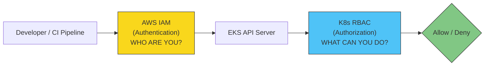

### The Bridge: aws-auth ConfigMap

The `aws-auth` ConfigMap is the **critical bridge** between AWS IAM and Kubernetes RBAC. It maps IAM entities (roles/users) to Kubernetes groups.

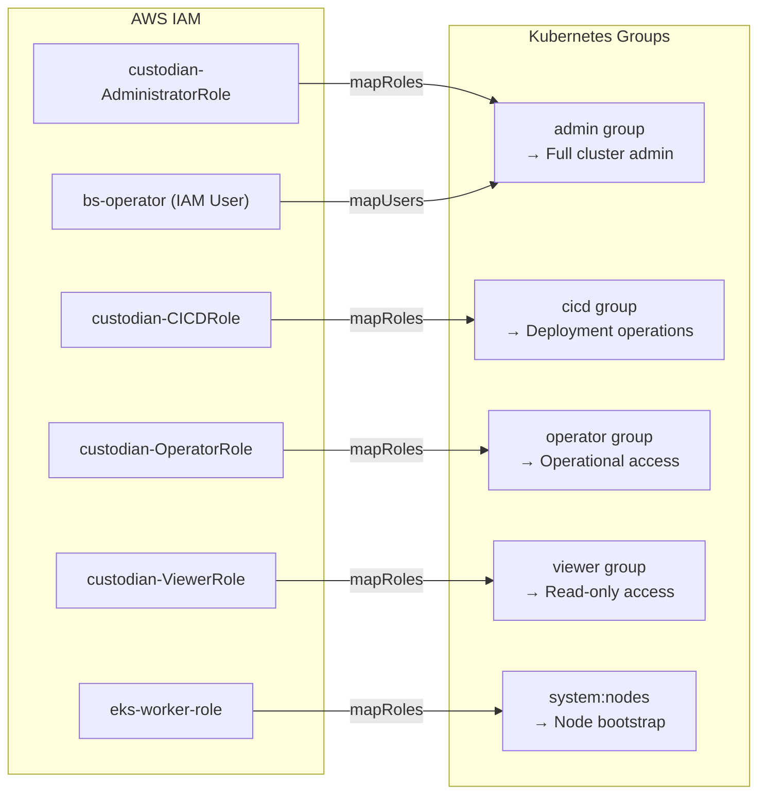

### K8s Built-in Groups

| Group | ClusterRole | Permissions | Used For |
|-------|-------------|-------------|----------|
| `system:masters` | `cluster-admin` | **Full cluster access** — all resources, all verbs, all namespaces | Emergency admin (not used in normal aws-auth mapping) |
| `system:nodes` | `system:node` | Node self-registration, pod status updates, secrets/configmaps for assigned pods | Worker nodes (kubelet) |
| `system:bootstrappers` | `system:node-bootstrapper` | Create/approve CSRs for node TLS certificates | New nodes joining cluster |

### Custom K8s Groups (Project-Specific)

These groups are defined in the `aws-auth` ConfigMap and require corresponding `ClusterRoleBinding` resources to grant permissions:

| Group | Intended Scope | Required ClusterRoleBinding |
|-------|---------------|---------------------------|
| `admin` | Full cluster administration | Bind to `cluster-admin` ClusterRole |
| `cicd` | Deployment operations | Bind to custom ClusterRole (deployments, services, configmaps) |
| `operator` | Operational access | Bind to custom ClusterRole (pods, logs, exec, secrets read) |
| `viewer` | Read-only access | Bind to `view` built-in ClusterRole |

> **Note:** These custom groups require `ClusterRoleBinding` resources to be created separately. Without corresponding bindings, users mapped to these groups will have no permissions.

---

## 2. Overall RBAC Architecture

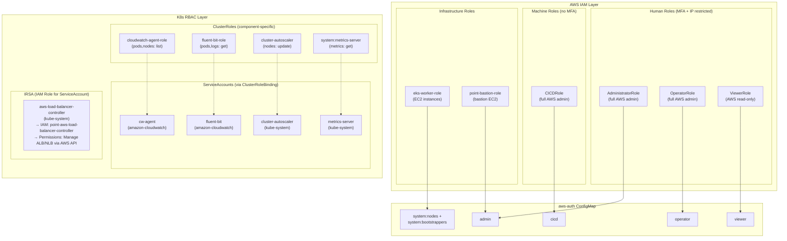

---

# Part B: AWS IAM Roles → K8s Group Mapping

## 1. aws-auth ConfigMap (per environment)

The `aws-auth` ConfigMap is the **only mechanism** to grant IAM entities access to the EKS cluster. Without an entry here, even an IAM admin cannot run `kubectl`.

### DEV Environment (Account: `845131030484`)

**File:** `k8s-manifests/point/dev-ex/aws-auth-cm.yaml`

```yaml
apiVersion: v1
kind: ConfigMap
metadata:
  name: aws-auth
  namespace: kube-system
data:
  mapRoles: |
    - rolearn: arn:aws:iam::845131030484:role/eks-worker-role
      username: system:node:{{EC2PrivateDNSName}}
      groups:
        - system:bootstrappers
        - system:nodes
    - rolearn: arn:aws:iam::845131030484:role/custodian-CICDRole
      username: custodian-CICDRole
      groups:
        - cicd
    - rolearn: arn:aws:iam::845131030484:role/custodian-AdministratorRole
      username: custodian-AdministratorRole
      groups:
        - admin
    - rolearn: arn:aws:iam::845131030484:role/custodian-OperatorRole
      username: custodian-OperatorRole
      groups:
        - operator
    - rolearn: arn:aws:iam::845131030484:role/custodian-ViewerRole
      username: custodian-ViewerRole
      groups:
        - viewer
    - rolearn: arn:aws:iam::845131030484:role/point-bastion-role
      username: point-bastion-role
      groups:
        - admin
  mapUsers: |
    # dev-ex only
    - userarn: arn:aws:iam::845131030484:user/bs-operator
      username: bs-operator
      groups:
        - admin
```

### STG Environment (Account: `520411743393`)

**File:** `k8s-manifests/point/stg-ex/aws-auth-cm.yaml`

| IAM Entity | Type | DEV Username | STG Username | K8s Group |
|------------|------|-------------|-------------|-----------|
| `eks-worker-role` | Role | `system:node:{{...}}` | `system:node:{{...}}` | `system:nodes` + `system:bootstrappers` |
| `custodian-CICDRole` | Role | `custodian-CICDRole` | `custodian-CICDRole` | `cicd` |
| `custodian-AdministratorRole` | Role | `custodian-AdministratorRole` | `custodian-AdministratorRole` | `admin` |
| `custodian-OperatorRole` | Role | `custodian-OperatorRole` | `custodian-OperatorRole` | `operator` |
| `custodian-ViewerRole` | Role | `custodian-ViewerRole` | `custodian-ViewerRole` | `viewer` |
| `point-bastion-role` | Role | `point-bastion-role` | `point-bastion-role` | `admin` |
| IAM User (env-specific) | User | `bs-operator` → `admin` | `temp-cyberzeal` → `viewer` | Differs per environment |

**Key observations:**
- Roles use **custom K8s groups** (`admin`, `cicd`, `operator`, `viewer`) instead of `system:masters`, enabling granular RBAC control.
- `DeveloperRole` has been **removed** from aws-auth in both environments.
- `ViewerRole` has been **added** with the `viewer` group for read-only cluster access.
- The bastion role maps to the `admin` group (full admin access from bastion).
- STG has a temporary user (`temp-cyberzeal`) mapped as `viewer` (read-only), while DEV has `bs-operator` mapped as `admin`.

---

## 2. IAM Role Definitions (Terraform)

Each IAM role is defined in Terraform with specific trust policies controlling who can assume them.

### Role Hierarchy and Trust Policies

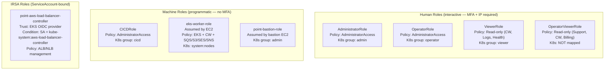

### Terraform Source Files

| Role | Terraform File | Trust Conditions |
|------|---------------|------------------|
| AdministratorRole | `terraform/infra/iam/role-AdministratorRole.tf` | MFA required, IP whitelist, session name match |
| OperatorRole | `terraform/infra/iam/role-OperatorRole.tf` | MFA required, IP whitelist, session name match |
| DeveloperRole | `terraform/infra/iam/role-DeveloperRole.tf` | MFA required, IP whitelist, session name match |
| CICDRole | `terraform/infra/iam/role-CICDRole.tf` | Session name match only (no MFA) |
| ViewerRole | `terraform/infra/iam/role-ViewerRole.tf` | MFA required, IP whitelist |
| OperatorViewerRole | `terraform/infra/iam/role-OperatorViewerRole.tf` | MFA required, IP whitelist |
| ALB Controller (IRSA) | `terraform/components/eks/aws-load-balancer-controller-role.tf` | OIDC provider, SA condition |

> **Note:** `DeveloperRole` still exists in Terraform IAM but has been **removed from aws-auth** — users who assume this role can access AWS console but cannot run `kubectl`.

---

## 3. Trust Policy Security Controls

All human IAM roles enforce these conditions in their trust policy:

**Condition 1: MFA**
- `"Bool": {"aws:MultiFactorAuthPresent": "true"}`
- User must authenticate with hardware/virtual MFA token

**Condition 2: IP Restriction**
- `"IpAddress": {"aws:SourceIp": ["office-ip/32", ...]}`
- Access only from whitelisted IPs (office, VPN)

**Condition 3: Session Name**
- `"StringEquals": {"sts:RoleSessionName": "${aws:username}"}`
- Session name must match IAM username (audit trail)

**Exceptions:**
- `CICDRole` skips MFA and IP (automated pipeline)
- `OperatorViewerRole` is NOT in aws-auth (can access AWS console but NOT kubectl)

---

# Part C: Component-Level RBAC

Each system component runs with a dedicated ServiceAccount and least-privilege ClusterRole.

## 1. RBAC per Component

### CloudWatch Agent

**File:** `k8s-manifests/amazon-cloudwatch/cwagent-serviceaccount.yaml`

**Purpose:** Collects container and node metrics, sends to CloudWatch.

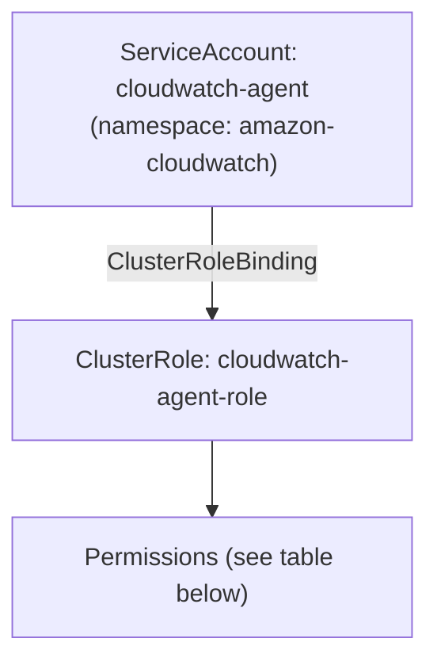

| API Group | Resources | Verbs |
|-----------|-----------|-------|
| `""` | pods, nodes, endpoints, services | list, watch |
| `""` | nodes/proxy | get |
| `""` | nodes/stats, configmaps, events | create |
| `""` | configmaps (specific: `cwagent-clusterleader`) | get, update |
| `apps` | replicasets | list, watch |
| `batch` | jobs | list, watch |
| `discovery` | endpointslices | list, watch |

**Why these permissions:** The agent needs to discover running pods/nodes to collect metrics, and uses a ConfigMap (`cwagent-clusterleader`) for leader election when running multiple replicas.

---

### Fluent Bit (Log Shipping)

**File:** `k8s-manifests/amazon-cloudwatch/fluent-bit.yaml`

**Purpose:** Ships container logs to CloudWatch Logs.

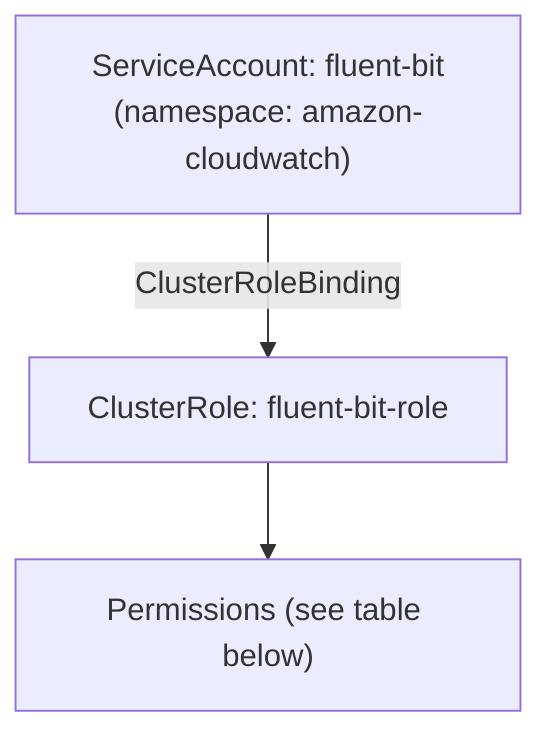

| API Group | Resources | Verbs |
|-----------|-----------|-------|
| `""` | namespaces, pods, pods/logs, nodes, nodes/proxy | get, list, watch |
| (non-resource URL) | `/metrics` | get |

**Why these permissions:** Fluent Bit needs to read pod metadata (labels, annotations) to enrich log entries with Kubernetes context (pod name, namespace, container name).

---

### Cluster Autoscaler

**File:** `k8s-manifests/kube-system/cluster-autoscaler-autodiscover.yaml`

**Purpose:** Automatically adjusts the number of worker nodes based on pod scheduling demands.

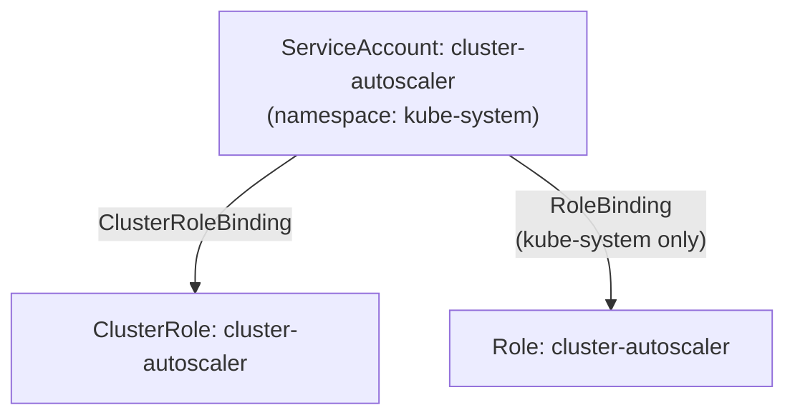

**ClusterRole permissions (cluster-wide):**

| API Group | Resources | Verbs | Why |
|-----------|-----------|-------|-----|
| `""` | events, endpoints | create, patch | Report scaling events |
| `""` | pods/eviction | create | Evict pods when scaling down nodes |
| `""` | pods/status | update | Update pod scheduling status |
| `""` | nodes | watch, list, get, update | Monitor and modify node state |
| `""` | namespaces, pods, services, replicationcontrollers, PVC, PV | watch, list, get | Discover workloads to decide scaling |
| `apps` | statefulsets, replicasets, daemonsets | watch, list, get | Track workload controllers |
| `storage.k8s.io` | storageclasses, csinodes, csidrivers, csistoragecapacities | watch, list, get | Consider storage constraints |
| `batch` | jobs | get, list, watch, patch | Handle batch job scaling |
| `coordination.k8s.io` | leases | create, get, update | Leader election (HA) |
| `policy` | poddisruptionbudgets | watch, list | Respect PDB during scale-down |

**Namespaced Role (kube-system only):**

| API Group | Resources | Verbs | Why |
|-----------|-----------|-------|-----|
| `""` | configmaps | create, list, watch | Store autoscaler state |
| `""` | configmaps (specific names) | delete, get, update, watch | Manage `cluster-autoscaler-status` |

**Why it needs more permissions:** The autoscaler must understand the entire cluster state (pods, nodes, storage, PDBs) to make intelligent scaling decisions without disrupting workloads.

---

### Metrics Server

**File:** `k8s-manifests/kube-system/metrics-server.yaml`

**Purpose:** Provides CPU/memory metrics for `kubectl top` and HPA (Horizontal Pod Autoscaler).

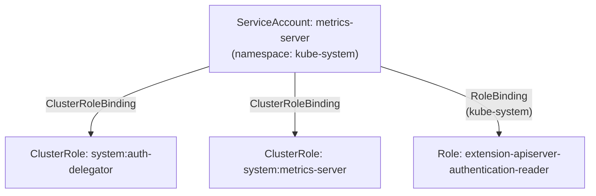

**ClusterRole: `system:aggregated-metrics-reader`** (aggregated into default roles):

| API Group | Resources | Verbs |
|-----------|-----------|-------|
| `metrics.k8s.io` | pods, nodes | get, list, watch |

**ClusterRole: `system:metrics-server`:**

| API Group | Resources | Verbs |
|-----------|-----------|-------|
| `""` | nodes/metrics | get |
| `""` | pods, nodes | get, list, watch |

---

### AWS Load Balancer Controller

**Files:**
- ServiceAccount: `k8s-manifests/point/{dev-ex,stg-ex}/aws-load-balancer-controller-service-account.yaml`
- Helm values: `k8s-manifests/point/{dev-ex,stg-ex}/aws-load-balancer-controller.yaml`
- IRSA role: `terraform/components/eks/aws-load-balancer-controller-role.tf`

**Purpose:** Provisions and manages AWS ALB/NLB resources from K8s Ingress/Service objects.

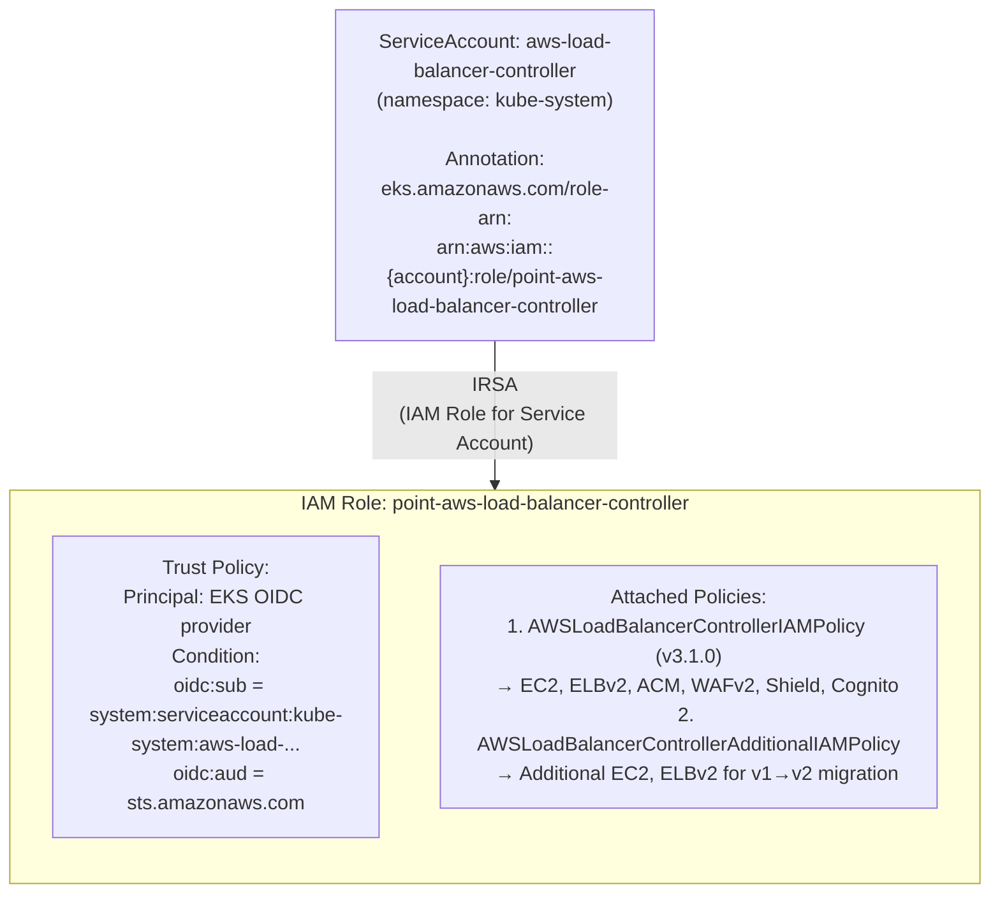

**IRSA Flow (how ServiceAccount gets AWS permissions):**

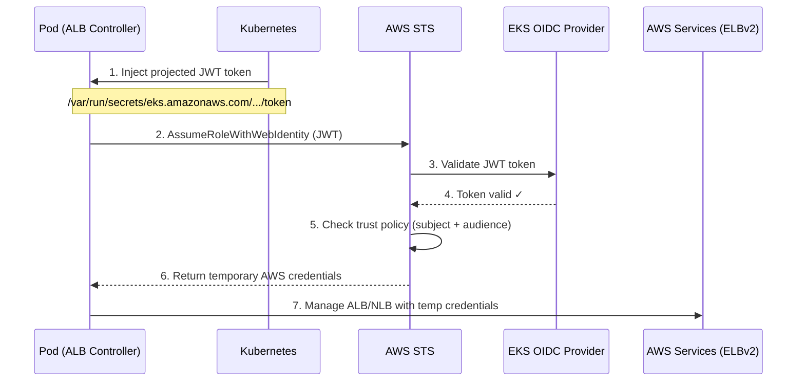

**Why IRSA is preferred:** Unlike the worker node IAM role (which grants the SAME permissions to ALL pods on the node), IRSA grants permissions to a SPECIFIC ServiceAccount. This follows the principle of least privilege.

**Helm RBAC settings:**

| Setting | Value | Purpose |
|---------|-------|---------|
| `rbac.create` | `true` | Helm creates ClusterRole/ClusterRoleBinding for the controller |
| `serviceAccount.create` | `false` | SA is pre-created (with IRSA annotation) — not created by Helm |
| `serviceAccount.name` | `aws-load-balancer-controller` | References the pre-created SA |
| `serviceAccount.automountServiceAccountToken` | `true` | Mount SA token for IRSA auth |

---

## 2. Component RBAC Comparison

| Component | Permission Scope | Description |
|-----------|:---:|-------------|
| fluent-bit | ▰▰░░░░░░░░ | Read pods/logs only |
| cloudwatch-agent | ▰▰▰░░░░░░░ | Read pods/nodes + leader ConfigMap |
| metrics-server | ▰▰▰░░░░░░░ | Read node metrics |
| ALB controller | ▰▰▰▰▰▰░░░░ | AWS API (ALB/NLB/EC2) via IRSA |
| cluster-autoscaler | ▰▰▰▰▰▰▰░░░ | Nodes + pods + eviction |
| admin group | ▰▰▰▰▰▰▰▰▰▰ | Full cluster access (via ClusterRoleBinding) |

---

# Part D: Worker Node IAM Permissions

Worker nodes (EC2 instances in the EKS node group) share a single IAM role. Most pods now use **IRSA** for AWS access, but the worker role still has duplicated policies as a transitional fallback.

## Attached Policies

**File:** `terraform/components/eks/worker-role-attach.tf`

| Policy | Type | Scope | Also via IRSA? | Status |
|--------|------|-------|:-:|--------|
| `AmazonEKSWorkerNodePolicy` | AWS Managed | EKS node operations | — | **Required** (kubelet) |
| `AmazonEC2ContainerRegistryReadOnly` | AWS Managed | ECR image pull | — | **Required** (image pull) |
| `AmazonEKSClusterAutoscalerPolicy` | Custom | Autoscaling groups | Yes (autoscaler IRSA) | **Duplicated** — remove after IRSA verified |
| `CloudWatchAgentServerPolicy` | AWS Managed | CloudWatch | Yes (cw-agent IRSA) | **Duplicated** — remove after IRSA verified |
| `AmazonSQSFullAccess` | AWS Managed | **All SQS queues** | Yes (point-app IRSA) | **Duplicated** — remove after IRSA verified |
| `AmazonS3FullAccess` | AWS Managed | **All S3 buckets** | Yes (point-app IRSA) | **Duplicated** — remove after IRSA verified |
| `AmazonSESFullAccess` | AWS Managed | **All SES operations** | Yes (point-app IRSA) | **Duplicated** — remove after IRSA verified |
| `AmazonSNSFullAccess` | AWS Managed | **All SNS topics** | Yes (point-app IRSA) | **Duplicated** — remove after IRSA verified |
| `AmazonKinesisFullAccess` | AWS Managed | **All Kinesis streams** | Yes (point-app IRSA) | **Duplicated** — remove after IRSA verified |

> **Note:** `AmazonEKS_CNI_Policy` is **not** on the worker role — it is granted exclusively via IRSA to `kube-system/aws-node` (see `vpc-cni-role.tf`).

**Worker Node Permissions Flow:**

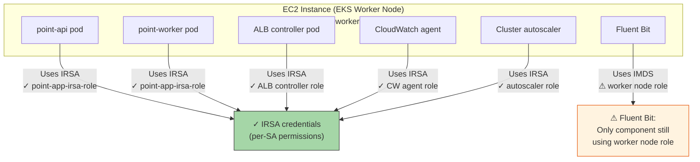

---

# Part E: Security Contexts

Security contexts define OS-level security settings for pods/containers.

## Component Security Comparison

| Component | `runAsNonRoot` | `readOnlyRootFilesystem` | `allowPrivilegeEscalation` | `capabilities.drop` | `runAsUser` | `seccompProfile` |
|-----------|:-:|:-:|:-:|:-:|:-:|:-:|
| ALB Controller | Yes | Yes | No (false) | — | — | — |
| Metrics Server | Yes | Yes | No (false) | `ALL` | 1000 | RuntimeDefault |
| Cluster Autoscaler | Yes | Yes | No (false) | `ALL` | 65534 | RuntimeDefault |
| CloudWatch Agent | — | — | — | — | — | — |
| Fluent Bit | — | — | — | — | — | — |
| **Application (point)** | **Yes** | **—** | **—** | **—** | **—** | **RuntimeDefault** |

**Legend:** "Yes" = configured, "—" = not configured (uses defaults)

> **Note:** Application pods define `runAsNonRoot: true` and `seccompProfile: RuntimeDefault` in the base deployment template (`k8s-manifests/point/base/deployment.yaml`), but do not yet set `readOnlyRootFilesystem`, `capabilities.drop`, or `runAsUser`.

**Security Context Maturity:**

| Component | Maturity | Rating |
|-----------|----------|--------|
| Metrics Server | Full hardening (all fields set) | ▰▰▰▰▰▰▰▰▰▰ |
| Cluster Autoscaler | Full hardening (all fields set) | ▰▰▰▰▰▰▰▰▰▰ |
| ALB Controller | Good (missing capabilities, seccomp) | ▰▰▰▰▰▰▰░░░ |
| Application (point) | Partial (runAsNonRoot + seccomp, missing capabilities/readOnlyFS) | ▰▰▰▰░░░░░░ |
| CloudWatch Agent | No security context | ░░░░░░░░░░ |
| Fluent Bit | No security context | ░░░░░░░░░░ |

---

# Part F: Deployment Order (k8s_apply.sh)

The `k8s_apply.sh` script deploys RBAC-related resources in a specific order:

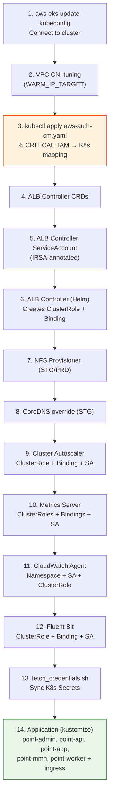

**Key ordering dependencies:**
- `aws-auth` must be applied **first** (step 3) — without it, subsequent `kubectl apply` commands from CI/CD or bastion would fail
- ALB Controller CRDs must be applied **before** Helm install (step 4 before 6)
- ServiceAccount with IRSA annotation must exist **before** the controller pod starts (step 5 before 6)
- Application deployments come **last** (step 14) — they depend on secrets (step 13) and ingress controller (step 6)

---

# Part G: IRSA (IAM Roles for Service Accounts) Deep Dive

IRSA is the EKS mechanism for granting AWS IAM permissions to specific Kubernetes ServiceAccounts, replacing the old approach of using the worker node's IAM role.

## How IRSA Works

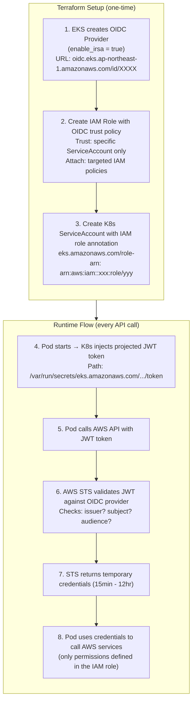

## Current IRSA Usage

The project defines **5 IRSA roles** covering all major components:

| Component | Uses IRSA? | IAM Role | Permissions |
|-----------|:-:|----------|-------------|
| VPC CNI (aws-node) | Yes | `point-vpc-cni-aws-node` | `AmazonEKS_CNI_Policy` (ENI/IP management) |
| Application (point) | Yes | `point-app-irsa-role` | SQS, S3, SES, SNS, Kinesis, CloudWatch |
| ALB Controller | Yes | `point-aws-load-balancer-controller` | EC2, ELBv2, ACM, WAFv2, Shield |
| Cluster Autoscaler | Yes | `point-cluster-autoscaler-irsa-role` | `AmazonEKSClusterAutoscalerPolicy` (ASG management) |
| CloudWatch Agent | Yes | `point-cloudwatch-agent-irsa-role` | `CloudWatchAgentServerPolicy` |
| Fluent Bit | No | Worker node role (IMDS) | CloudWatch Logs |
| Metrics Server | N/A | — | No AWS access needed (K8s RBAC only) |

> **Note:** Worker node role still has duplicated policies (SQS, S3, SES, SNS, Kinesis, CloudWatch, Autoscaler) as a transitional fallback. These should be removed after IRSA is fully verified. See the [IRSA Guide](k8s-irsa-guide.en.md) for detailed analysis.

**Terraform IRSA configuration:**

```
terraform/components/eks/
├── main.tf                                  ← enable_irsa = true (OIDC provider)
├── vpc-cni-role.tf                          ← VPC CNI IRSA (data sources pattern)
├── point-app-irsa-role.tf                   ← Application IRSA (6 AWS managed policies)
├── aws-load-balancer-controller-role.tf     ← ALB Controller IRSA
├── aws-load-balancer-controller-policy.tf   ← ALB Controller IAM policies (from GitHub v3.1.0)
├── cluster-autoscaler-irsa-role.tf          ← Cluster Autoscaler IRSA
├── cluster-autoscaler-policy.json           ← Autoscaler custom policy
└── cloudwatch-agent-irsa-role.tf            ← CloudWatch Agent IRSA
```

---

# Part H: Security Observations & Recommendations

## Current Security Posture

### What's good

| Practice | Implementation | Rating |
|----------|---------------|--------|
| Custom K8s groups in aws-auth | Roles mapped to `admin`/`cicd`/`operator`/`viewer` instead of `system:masters` | Excellent |
| IRSA for 5 components | VPC CNI, App, ALB Controller, Autoscaler, CW Agent all use per-SA IAM roles | Excellent |
| IMDSv2 enforced with hop limit 1 | Pods cannot fall back to node instance profile via IMDS | Excellent |
| MFA + IP restriction on human roles | Trust policy conditions | Excellent |
| Security contexts on system + app components | Non-root, seccomp on app; full hardening on metrics-server, autoscaler | Good |
| aws-auth managed as code | Version-controlled ConfigMap | Good |
| Separate viewer roles | ViewerRole with read-only K8s group | Good |
| DeveloperRole removed from aws-auth | Reduced attack surface | Good |

### What needs improvement

| Issue | Current State | Risk | Recommendation |
|-------|--------------|------|----------------|
| **ClusterRoleBindings for custom groups** | Custom groups defined in aws-auth but may lack corresponding ClusterRoleBinding resources | Users may have no permissions or rely on legacy bindings | Create explicit ClusterRoleBindings for each custom group |
| **No namespace-level RBAC** | All access is cluster-wide | No workload isolation | Create namespace-scoped Roles for operators |
| **No NetworkPolicy** | All pods can communicate freely | Lateral movement risk | Define NetworkPolicies per namespace |
| **No Pod Security Admission** | No PSA labels on namespaces | Privileged pods allowed | Add `pod-security.kubernetes.io/enforce: baseline` labels |
| **App pods partial security context** | Has `runAsNonRoot` + seccomp, but no `readOnlyRootFilesystem`, no `capabilities.drop` | Reduced but not eliminated container escape risk | Add `readOnlyRootFilesystem: true` and `capabilities.drop: [ALL]` |
| **Worker node IAM has duplicated policies** | 7 policies duplicated between worker role and IRSA roles (SQS, S3, SES, SNS, Kinesis, CW, Autoscaler) | If IRSA fails, pods silently fall back to worker role; masks errors | Remove duplicated policies from worker role after verifying IRSA |
| **Fluent Bit not using IRSA** | Uses IMDS/worker node role for CloudWatch Logs access | Inconsistent auth model; depends on worker role policies | Create IRSA role for Fluent Bit |

### Recommended Next Steps

| Priority | Action | Details |
|:--------:|--------|---------|
| 1 | **Create ClusterRoleBindings for custom groups** | Bind `admin` → `cluster-admin`, `cicd` → custom deployer role, `operator` → custom operator role, `viewer` → built-in `view` ClusterRole |
| 2 | **Define custom ClusterRoles** | `custom:deployer` (deployments, services, configmaps, ingress), `custom:operator` (pods, logs, exec, secrets read) |
| 3 | **Remove duplicated worker role policies** | After verifying IRSA works, remove SQS/S3/SES/SNS/Kinesis/CW/Autoscaler from worker role (keep only EKS Worker + ECR Read) |
| 4 | **Complete app security contexts** | Add `readOnlyRootFilesystem: true` and `capabilities.drop: [ALL]` to base deployment.yaml |
| 5 | **Create IRSA for Fluent Bit** | Last component still using worker node role for AWS access |

---

# Part I: Reference Files

## K8s Manifest Files

| File | Contains |
|------|----------|
| `k8s-manifests/point/dev-ex/aws-auth-cm.yaml` | DEV aws-auth ConfigMap |
| `k8s-manifests/point/stg-ex/aws-auth-cm.yaml` | STG aws-auth ConfigMap |
| `k8s-manifests/point/dev-ex/aws-load-balancer-controller-service-account.yaml` | DEV ALB Controller SA (IRSA) |
| `k8s-manifests/point/stg-ex/aws-load-balancer-controller-service-account.yaml` | STG ALB Controller SA (IRSA) |
| `k8s-manifests/point/dev-ex/aws-load-balancer-controller.yaml` | DEV ALB Controller Helm values |
| `k8s-manifests/point/stg-ex/aws-load-balancer-controller.yaml` | STG ALB Controller Helm values |
| `k8s-manifests/amazon-cloudwatch/cwagent-serviceaccount.yaml` | CW Agent SA + ClusterRole + Binding |
| `k8s-manifests/amazon-cloudwatch/fluent-bit.yaml` | Fluent Bit SA + ClusterRole + Binding + DaemonSet |
| `k8s-manifests/kube-system/cluster-autoscaler-autodiscover.yaml` | Autoscaler SA + ClusterRole + Role + Bindings |
| `k8s-manifests/kube-system/metrics-server.yaml` | Metrics Server SA + ClusterRoles + Bindings |
| `k8s-manifests/bin/k8s_apply.sh` | Deployment script (RBAC deployment order) |

## Terraform Files

| File | Contains |
|------|----------|
| `terraform/components/eks/main.tf` | EKS cluster config (`enable_irsa`, `manage_aws_auth`) |
| `terraform/components/eks/aws-load-balancer-controller-role.tf` | ALB Controller IRSA IAM role |
| `terraform/components/eks/aws-load-balancer-controller-policy.tf` | ALB Controller IAM policies |
| `terraform/components/eks/worker-role-attach.tf` | Worker node IAM policy attachments |
| `terraform/infra/iam/role-AdministratorRole.tf` | Administrator IAM role (MFA + IP) |
| `terraform/infra/iam/role-CICDRole.tf` | CI/CD IAM role (no MFA) |
| `terraform/infra/iam/role-OperatorRole.tf` | Operator IAM role (MFA + IP) |
| `terraform/infra/iam/role-DeveloperRole.tf` | Developer IAM role (MFA + IP) |
| `terraform/infra/iam/role-ViewerRole.tf` | Viewer IAM role (read-only AWS + read-only K8s) |
| `terraform/infra/iam/role-OperatorViewerRole.tf` | Operator Viewer IAM role (AWS-only, no K8s) |
